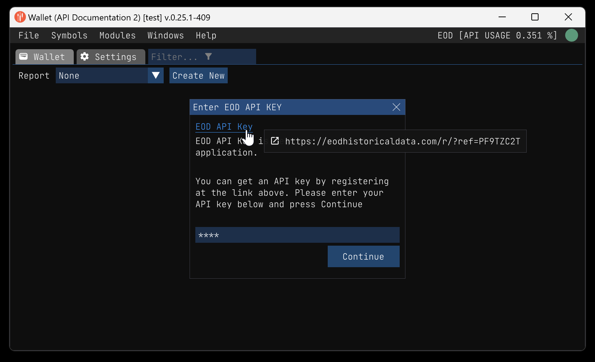
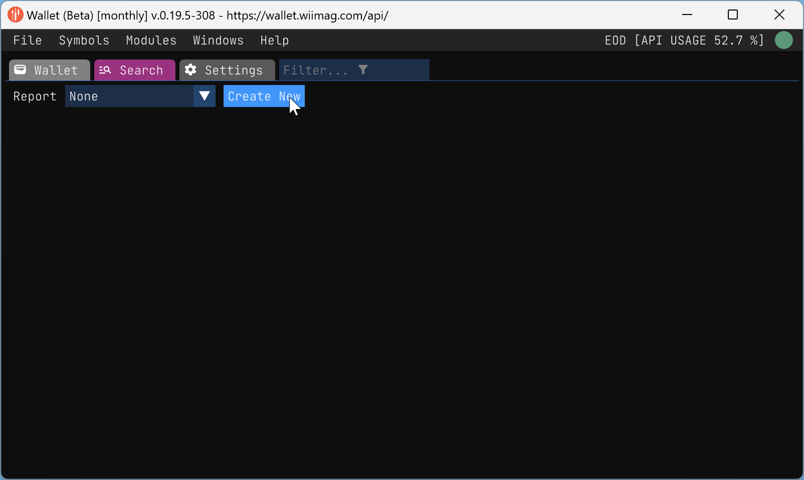
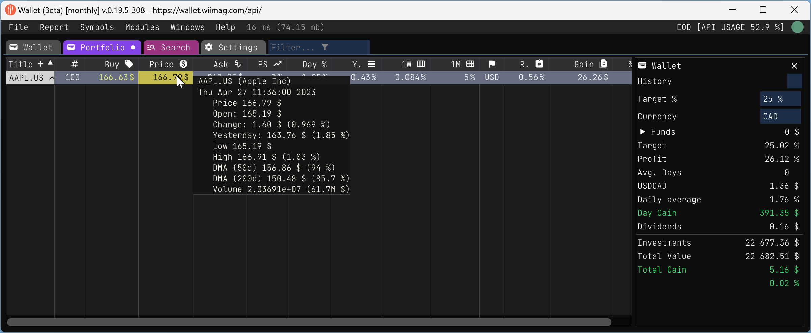

## Table of Contents

- [Getting Started](#getting-started)
  - [Installation](#installation)
  - [Create a new report](#create-a-new-report)
  - [Add a new stock](#add-a-new-stock)

- [Features](#features)
  - [Reports](./report.md)
      - [Buy Stock](buy_stock.md)
      - [Export report](report_export.md)
      - [Import report](report_import.md)
      - [Update symbol icon and banner images](update_icon.md)
  - [Symbols](./symbols.md)
      - [Bulk Extractor](./bulk_extractor.md)
  - [Patterns](./pattern.md)
      - [Stock pattern fundamentals](stock_pattern_fundamentals.md)
  - [Expressions](./expressions.md)
      - [Basic expressions](./expressions.md#basic-functions)
      - [Table expressions](./expressions.md#tabletitle-set-columns)
      - [Plot expressions](./expressions.md#plottitle-x_set-y_set-options)
      - [Stock expressions](./expressions.md#ssymbol-field-date-stock-or-eod)
      - [Report expressions](./expressions.md#rreport-title-field)
      - [Report column expressions](./expressions.md#column-expressions)
      - [Examples](./expressions.md#examples-5)

<!-- 
# TODO Define all section we want to be in the user manual
- [ ] Sell stock
- [ ] Report timeline
- [ ] Report summary
- [ ] Report title order details
- [ ] User settings
- [ ] Console
- [ ] Stock and report expressions
- [ ] Report columns
  - [ ] Individual column explanations
- [ ] Report column expressions
- [ ] Show sold titles
- [ ] Show titles with no quantity
- [ ] Report title transactions graph
- [ ] Symbols search
- [ ] Market symbols
- [ ] Symbol indexes
- [ ] Symbol currencies
- [ ] Last day data
- [ ] Alerts
- [ ] Macro indicators
- [ ] Search for new versions
- [ ] EOD usages
- [ ] Wallet tracking
- Pattern View
  - [ ] Pattern view
  - [ ] Stats
  - [ ] Graphics
--> 

## Introduction

Tired of losing money in the stock market like a forgetful gambler? Say hello to the Wallet app! It's not a tool for managing your bank account or credit card - that's what your banker is for (or your piggy bank if you're old school). Instead, it's a desktop app designed to help you manage your stocks like a pro, minus the stress and confusion.

Created out of frustration with the lack of a user-friendly and cheap stock management tool, the Wallet app was born from the ashes of a Google Spreadsheet that was slower than a snail on a lazy day (I was abusing the `GOOGLEFINANCE` function!). It's portable, fast, and easy to use.

And the best part? You don't have to be an expert to use the Wallet app - it's perfect for beginners and inexperienced investors too! It's designed to help you keep track of your stocks and finances, learn how to invest wisely, and make better decisions without feeling like you need a degree in finance. So why not give it a try and start your journey to becoming a stock market pro?

## Getting Started

### Installation

The Wallet is a portable desktop app. It is available for Windows and Mac as of now. 

You can <a href="https://wallet.wiimag.com/releases/latest" donwload>download</a> the app from the app [web site](https://wallet.wiimag.com) (<https://wallet.wiimag.com>).

I am using WiX packing to create the installer. The installer is a self-extracting archive, so that said, 
it is possible that your antivirus software will detect it as a virus. It is not a virus. It is a false positive.

But I can't blame you if you don't trust me. So you can download the source code and compile it yourself if you have
access to <https://github.com/wiimag/wallet>. I'll try to improve the installer in the future, meanwhile you can
check the installer with your antivirus software.

Once you have the installer downloaded somewhere on your computer, you can run it.

|   |   |
|---|---|
|  |  |

The application will be automatically installed under `C:\<user home>\AppData\Local\Wallet`. The application do not require administrator privileges to run.

When the installation process is finished the application will be launched automatically the first time.

Here's the first screen you will see. You can click the [EOD API Key](https://eodhistoricaldata.com/r/?ref=PF9TZC2T) button get your API key.

I strongly recommend that you get an API key with all the features. It will cost you around 80 US$ per month. But it is worth it. In most country you can deduct that cost from your taxes.

Ok so you have your API key. You can paste it and press `Continue`.

So far so good. You are now ready to use the application.

### Create a new report

When you create a new report, you have to choose a name for your report. You can choose any name you want, but I suggest you keep it short and simple. Lets say you want to create a report for your stock portfolio. You can name it `Portfolio`.

### Add a new stock

Once you have created a new report, you can add a new stock to your report. You can add as many stock as you want. But for that walkthrough, we will add only a few ones. Lets start with the classic one `AAPL.US` (Apple Inc.).

Once you've selected the stock, you can click on the `Add` button. Then you'll be prompt to enter a first transaction for that stock. You can press `Cancel` if you don't want to enter a transaction right now. But for that walkthrough, we will enter a transaction.

Press `Apply` to save the transaction. Then you'll be back to the report tab.

That's the gist of it. You can add as many stock as you want. You can also add as many reports as you want. You can create a report for your stock portfolio, another one for your crypto portfolio, another one for your watchlist, etc.

## Features

- [Reports](./report.md)
    - [Buy Stock](buy_stock.md)
    - [Export report](report_export.md)
    - [Import report](report_import.md)
    - [Update symbol icon and banner images](update_icon.md)
- [Symbols](./symbols.md)
    - [Bulk Extractor](./bulk_extractor.md)
- [Patterns](./pattern.md)
    - [Stock pattern fundamentals](stock_pattern_fundamentals.md)
- [Expressions](./expressions.md)
    - [Basic expressions](./expressions.md#basic-functions)
    - [Table expressions](./expressions.md#tabletitle-set-columns)
    - [Plot expressions](./expressions.md#plottitle-x_set-y_set-options)
    - [Stock expressions](./expressions.md#ssymbol-field-date-stock-or-eod)
    - [Report expressions](./expressions.md#rreport-title-field)
    - [Report column expressions](./expressions.md#column-expressions)
    - [Examples](./expressions.md#examples-5)
