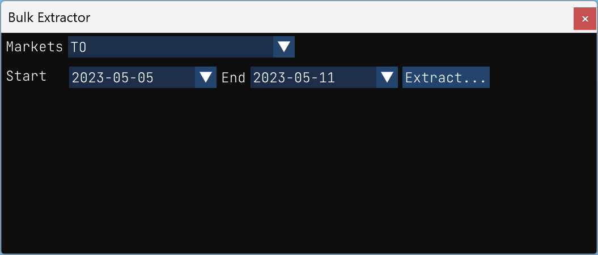
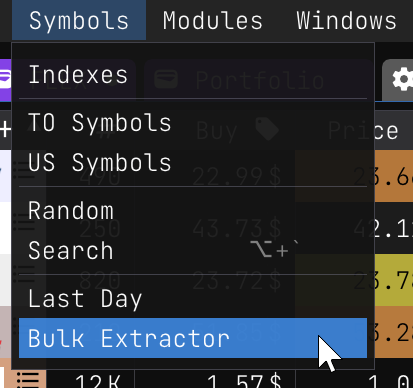

## Bulk Extractor

The bulk extractor is a powerful tool that allows you to efficiently extract data from a list of symbols. 

Using the bulk extractor, you can easily select a range of dates and a list of symbols, and the tool will automatically extract the relevant data for each symbol and save it in a JSON file, organized by dates. This makes it easy to import the data into another tool for further analysis or to create visualizations.

Overall, the bulk extractor is an essential tool for anyone who needs to extract data from a list of symbols quickly and efficiently. Its intuitive interface and flexible features make it a valuable asset for data analysts, traders, and investors alike.

### How to use the bulk extractor

|        |         |
|--------|--------:|
| The bulk extractor is accessible from the `Symbols/Bulk Extractor` menu. This action will open a new dialog window in which you can configure the parameters for the extraction. |  |

The bulk extractor consists of two main components:

- The markets from which you wish to extract data
- The start and end dates for the data extraction

Once you have configured these parameters, simply click on the `Extract...` button to initiate the data extraction process. The bulk extractor will then automatically extract the relevant data for each symbol and organize it into a JSON file based on dates. This file can be easily imported into another tool for further data analysis.

To keep you informed of the extraction progress, the bulk extractor displays real-time updates in the status bar at the bottom of the window. This allows you to monitor the progress of the extraction and estimate the time remaining until completion.

Overall, the bulk extractor is a simple yet powerful tool that enables you to quickly and efficiently extract data from multiple markets for specific dates. Its user-friendly interface and progress updates make it a valuable tool for traders, investors, and data analysts alike.


Once the extraction is completed, you can click on the file path link displayed at the bottom of the window.

### Extracted data preview

Here's a preview of the exported data:


Not all the data is exported for every symbols. It depends on the data available for each symbol. For example, if a symbol has no `avgvol_200d`, the `avgvol_200d` field will not be exported. Here's a preview JSON preview of a symbol available data:

```json
"TOU.TO" = { 
    cap = 18957981696.00 
    volume = 2506300.00 
    price = 54.13 
    close = 55.54 
    open = 58.13 
    avgvol_200d = 2273829.50 
    avgvol_50d = 2237870.00 
    avgvol_14d = 1891150.00 
    lo_250d = 50.23 
    hi_250d = 76.88 
    ema_200d = 60.63 
    ema_50d = 57.31 
    low = 55.15 
    high = 58.41 
    beta = 1.60 
}
```

The exported file generated by the bulk extractor contains all valid symbols with their corresponding data, organized by dates. This data is extracted from the <a href="https://eodhistoricaldata.com/financial-apis/bulk-api-eod-splits-dividends/?ref=PF9TZC2T" target=_blank>EOD Historical Data</a> API.

It's important to note that the file size can quickly become very large if you extract data for a long period of time. Therefore, make sure that you have sufficient disk space available and allow enough time for the extraction process to complete.

Despite the potential large file size, the bulk extractor remains a valuable tool for data analysts, traders, and investors. It allows you to efficiently extract data from multiple markets and organize it into a format that is easy to analyze and import into other tools.
