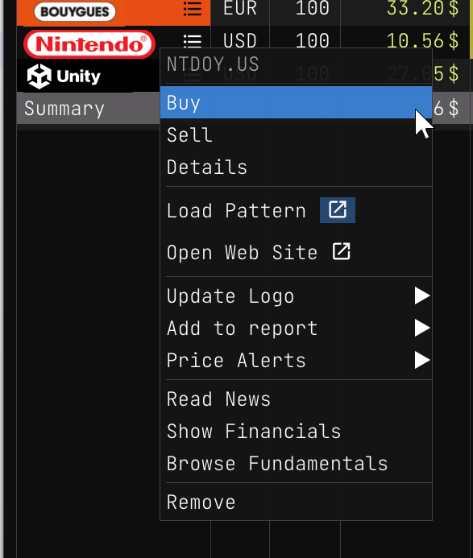
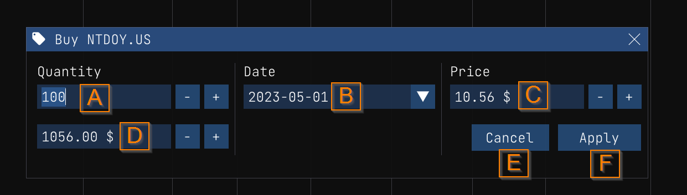
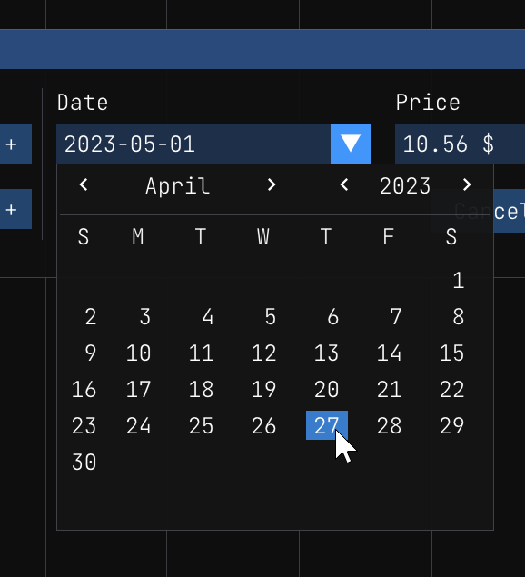
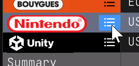
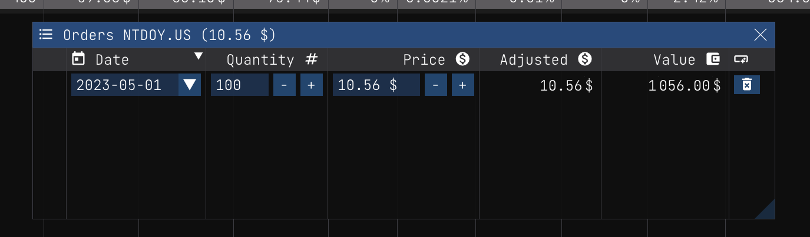

$theme: default
$title: Buy Stock

Buy Stock
=========

To log a buy transaction, you can right click on the stock symbol and select `Buy`.

When the `Buy` dialog is displayed, you can enter the transaction details.

Here's the list of the fields:

**Quantity (A)**: The number of shares you bought. You can enter a decimal number. For example, if you bought 10.5 shares, you can enter `10.5` in the field.

**Date (B)**: The date of the transaction. The date format is `YYYY-MM-DD`. To use the date picker, you can click on the dropdown icon. Then you can select the date you want. You can use the header arrows to change the current month and year. When you change the selected date, we update the **Price (C)** field with the closing price of the selected date. 

**Price (C)**: The price of the share. You can enter a decimal number. For example, if you bought the share at 100.5 USD, you can enter `100.5` in the field. It is important that you enter the price in the same currency as the stock symbol. For example, if you bought a share of `AAPL.US` (Apple Inc.) you have to enter the price in USD. If you bought a share of `AAPL.EUR` (Apple Inc.) you have to enter the price in EUR.

**Total (D)**: The total amount of the transaction. The total amount is the price multiplied by the quantity. For example, if you bought 10 shares at 100.5 USD, the total amount is 1005 USD. You can also use that field to enter the amount you want to invest. For example, if you want to invest 1000 USD, you can enter `1000` in the field. Then we will calculate the quantity for you. In that case, the quantity will be 9.95 shares.

**Cancel (E)**: You can click on the `Cancel` button to cancel the transaction.

**Apply (F)**: You can click on the `Apply` button to apply the transaction.

When you have applied the transaction, you can see the transaction in the `Order details` dialog to confirm that the transaction was applied correctly.

