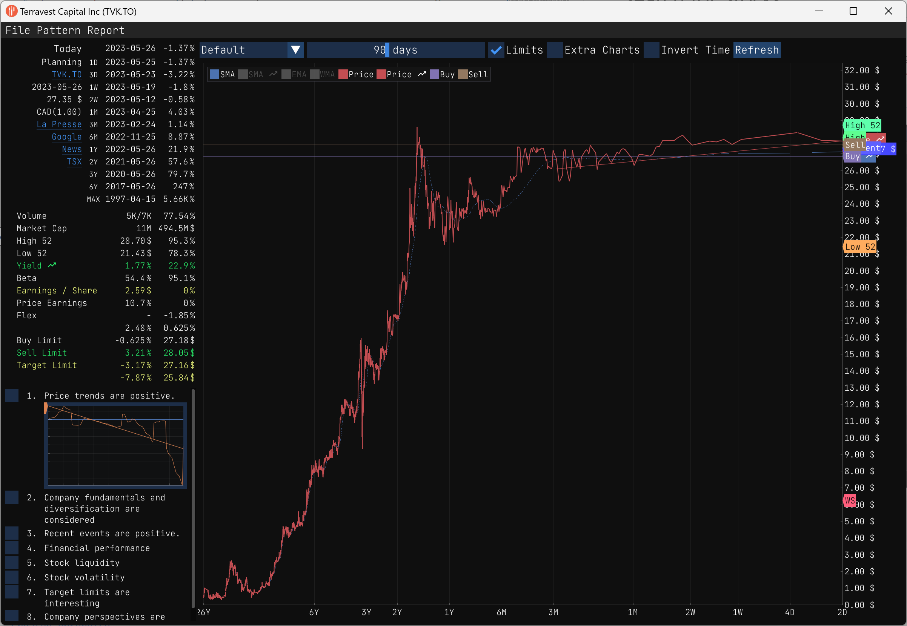
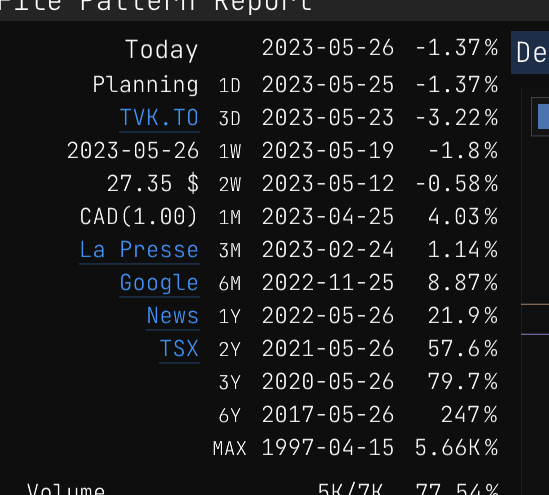
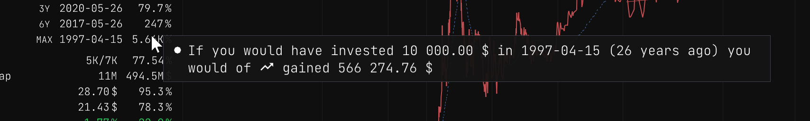
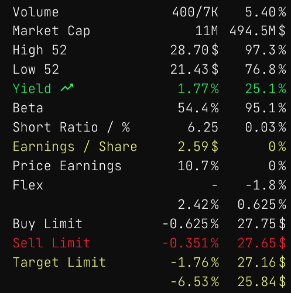
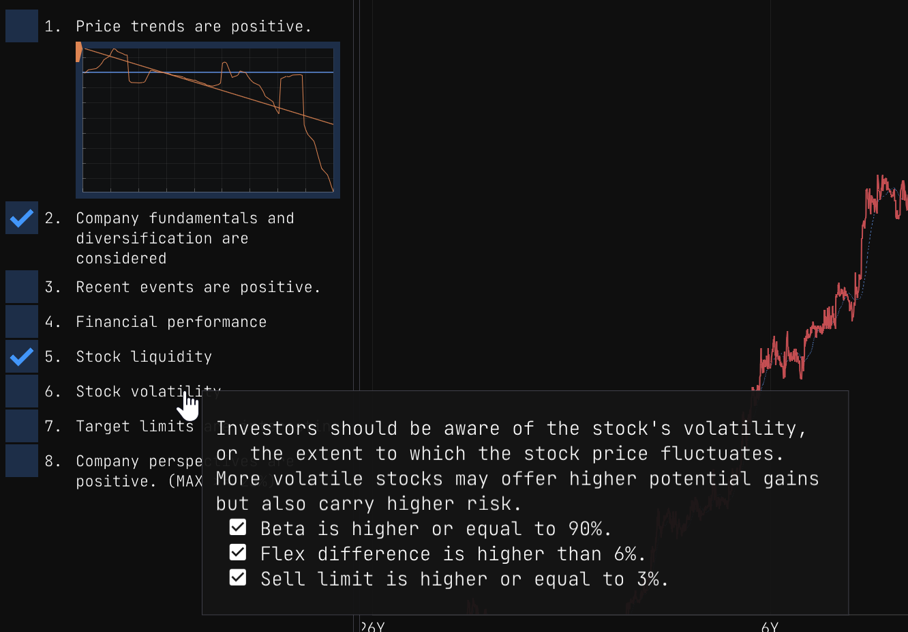
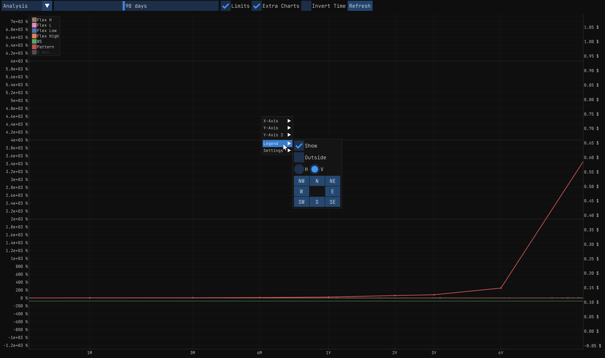
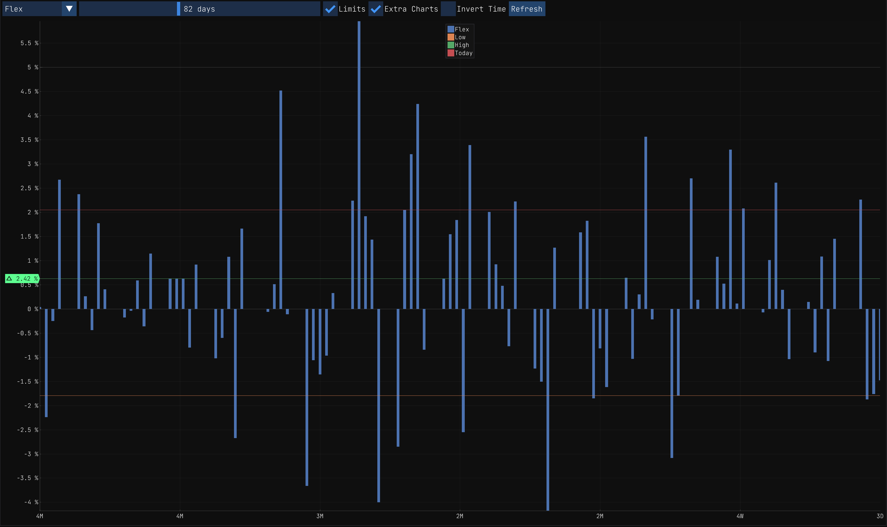
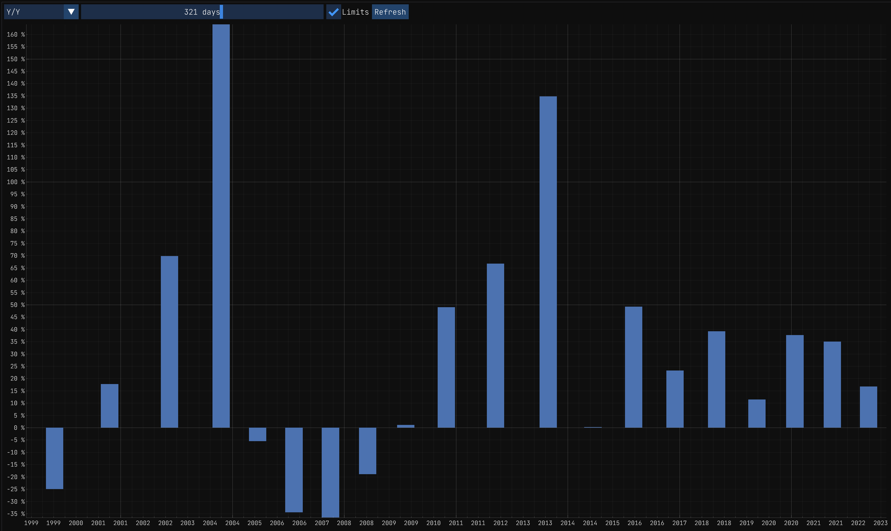
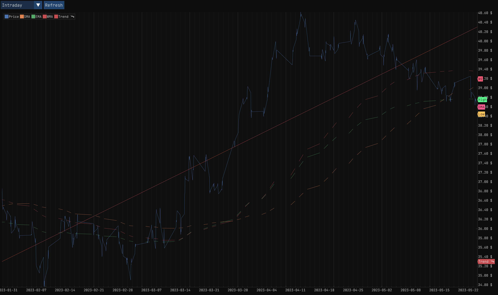

---
title: Stock Pattern
--- 

Stock Pattern
=============

The Pattern View is a tool for analyzing stock patterns. It consolidates stock technical, end-of-day (EOD), and fundamental data to help you identify patterns and make informed decisions.

In most scenarios, when you have capital to invest, you'll want to find a stock that is in a good moment to buy. The Pattern View is a tool that can assist you in finding these stocks. It's not a magic tool that will provide exact instructions, but it will help you locate stocks that are in a favorable buying position.

But first, you need to find some stocks to analyze. You can use the search tool to find stocks that you want to analyze. Additionally, you can utilize the market symbols browser to discover stocks that are currently in a good buying position.

# Search for Stocks

The first step is to find some stocks that you want to analyze. Open up the [search tool](./search.md) and search for the desired stocks. Let's assume we are interested in finding stocks related to farming and agriculture. We can perform the following search: `agriculture country:canada -sector:"financial services" -exchange:v`. This search query will yield the following results:

I sorted the search results by dividend ratio payout, as I prefer to invest in stocks that pay dividends. Based on this criterion and the Year-After-Year performance, I have selected `TVK.TO` from the search results as I am personally interested in analyzing this stock.

Ok, once the pattern view is open, you will see the following:

At a glance you can see that sicne 26 years ago, the stock has been overall in an uptrend. Lets take a look at the stock in more detail.

The pattern view is divided in 4 sections:

- Pattern marks (top-left),
- Technical data (middle-left),
- Pattern checks (bottom-left),
- Graphical data (right).

# Pattern marks

Pattern marks provide a quick way to see how the stock performed in the past compared to the current price. The pattern marks are displayed in the top-left section of the pattern view.

The pattern marks are presented in a table, with each row representing a specific pattern mark. The table is ordered chronologically, placing the most recent pattern mark at the top.

Although there has been a recent decline in the stock price, it's worth noting that the stock is still exhibiting an overall upward trend, making it potentially suitable for long-term investment.

An interesting and interactive feature allows you to hover over the MAX mark. By doing so, you can observe the potential gains you would have accumulated if you had invested in the stock since its inception. It adds an element of fun and helps visualize the potential profitability of a long-term investment strategy.

Investing $10,000 twenty-six years ago would have resulted in an impressive return of approximately $500,000. It's undeniably a significant gain, but unfortunately, that opportunity has long passed us by.

Now, let's shift our focus to the recent pattern marks. The most recent pattern mark represents the current price of the stock. This price corresponds to the end-of-day value and is displayed below the current date. As of now, the current price stands at $27.35.

Upon reviewing the pattern marks, they appear favorable to me, and I would seriously consider purchasing the stock for a long-term investment. However, it's crucial to examine the technical data and indicators to ensure there are no factors that might influence a change of mind.

# Technical data

Upon further analysis, it is observed that the stock has an average daily volume of approximately 7,000 shares. This volume is relatively low, which may not be preferable for some investors, including myself. A higher average daily volume is generally more desirable.

A low volume of shares indicates that the stock is not widely traded or popular among investors. It's important to consider the potential implications of investing in such a stock. If you purchase a stock with low popularity, you may encounter difficulties when attempting to sell it at a later time.

Given this information, it may be prudent to evaluate alternative stocks with higher average daily volumes to ensure ease of buying and selling in the future.

Lets go over the other technical data.

| Technical Data | First Column | Second Column |
|:---------------|:-------------|:--------------|
| **Volume** | Today's volume compared to the average daily volume of the last three months. | Volume ratio |
| **Market Cap** | The amount of outstanding shares as of today. | Market capitalization |
| **High 52** | The highest price of the stock in the last 52 weeks. | % compared to the current price |
| **Low 52** | The lowest price of the stock in the last 52 weeks. | % compared to the current price |
| **Yield** | The dividend yield of the stock. | The Year-After-Year performance of the stock. |
| **Beta** | The beta of the stock. | The beta of the stock compared to its main indices |
| **Short Ratio / %** | The short ratio of the stock. | The short percent of the stock. |
| **Earnings / Share** | The earnings per share of the stock. | The earnings surprise ratio of the stock for the last four quarters. |
| **P/E** | The price-to-earnings ratio of the stock. | The forward price-to-earnings ratio of the stock. |
| **Flex Low** | A computed metrics based on the stock's volatility when it is in a downtrend. | The percent of the Flex Low compared to the current price. |
| **Flex High** | A computed metrics based on the stock's volatility when it is in an uptrend. | The percent of the Flex High compared to the current price. |
| **Buy Limit** | The percentage drop from the current price that would trigger a buy signal. | The buy limit price. |
| **Sell Limit** | The percentage increase from the current price that would trigger a sell signal. | The sell limit price. |
| **Target Limit** | The percentage increase from the current price that would trigger a target signal. | The Wall Street and DMA 200 price targets used for comparison. |

# Check Marks

Check marks are there so the you make sure to invest responsibly. They are displayed in the bottom-left section of the pattern view.

Each mark reminds you to consider a specific aspect of the stock before making a decision. The check marks are displayed in a table, with each row representing a specific check mark.

You can hover over each check mark to see a description of the check mark and its purpose.

In the current version the marks are fixed, but in the future you will be able to customize them to your liking.

# Graphical Data

The right section of the pattern view is dedicated to graphical data. It contains a drop down menu that allows you to select the type of graph you want to display. The available options are:

## Default

The default graph displays the stock price over time. The graph is interactive, allowing you to hover over the graph to see the price at a specific point in time.

## Analysis

This graph display the price changes on a logarithmic scale. 

It is important to remind that you can always right click on the graph to customize it to your liking.

## Flex

The Flex graph is quite interesting when you want to see the volatility of the stock. It displays the Flex Low and Flex High values over time.

## Trend

The Trend graph is the magic sauce to evaluate the trend of the stock on a short term. You can use the day range slider to select the number of days you want to evaluate. The graph will display the trend of the stock for the selected number of days.

In example, if the trend is positive for the last 90 days I would consider buying the stock for a short or medium term investment. That said, short and mid term investments are riskier than long term investments and I would not recommend them to everyone unless you are willing to take the risk.

So in the end, this graphic can be useful to evaluate if you should sell or buy a stock for the upcoming days.

## Y/Y

The Y/Y graph is useful to evaluate the Year-After-Year performance of the stock.

## Intraday

The Intraday graph is useful to evaluate the price changes of the stock during the day. It displays the opening price, the closing price, the high price and the low price of the stock for the selected day.

## Activity

The Activity graph is useful to evaluate the activity based on the news and the social media. It displays the number of news and social media posts for the selected day.
