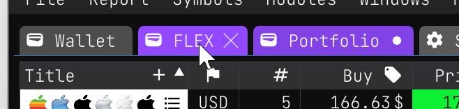
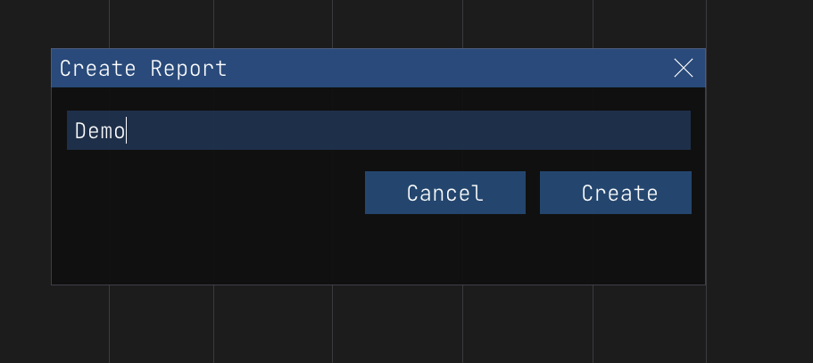
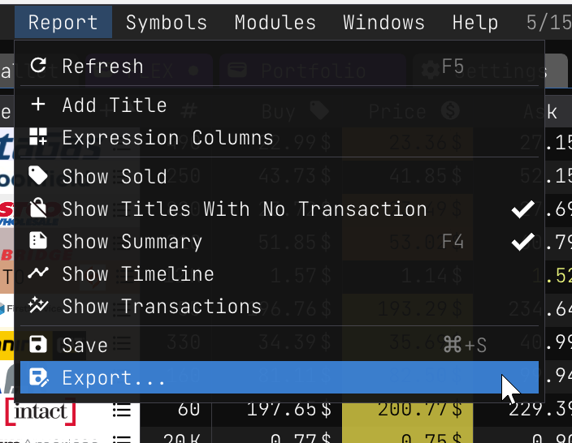
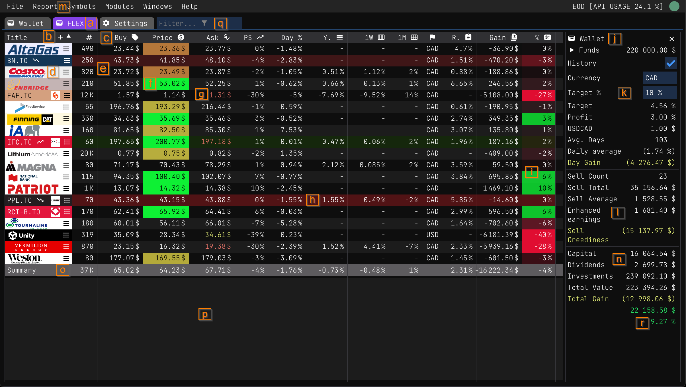

# Tabs

A report is the core piece of the application. It is where you track your stock and your sales. It is also where you can see your profit and loss. You can have as many reports as you want, but you can only have one active report at a time. 

## Switching between reports

You can switch between reports by clicking on the corresponding report tab.

## [Creating a report](./index.md#create-a-new-report)

You can create a new report by clicking on the `File/Create/Report` button or using the `F2` shortcut. You will be prompted to enter a name for the report. 

## Deleting a report

If you want to delete a report you can do so by right clicking on the report tab and selecting `Delete`. Watch out though, this will delete the report and all the data in it. There is no way to recover a deleted report. That said, it is always wise to export your report before deleting it so you can manually recover the data if you need to. You can [export](./report_export.md) a report by right clicking on the report tab and selecting `Export`.

### Backups

Actually, I kinda lied, since the Wallet app does a backup each new day you open it, you can recover a deleted report by going to the `backup` folder and copying the report file from there. You can find the `backup` folder under `%LOCALAPPDATA%\Wiimag Inc\backups`.

## Renaming a report

You can rename a report by right clicking on the report tab and selecting `Rename`.

## Closing a report

You can close a report by right clicking on the `X` button on the report tab. This will close the report and remove it from the report tabs. You can reopen a closed report by going to `File/Open/<REPORT NAME>` and selecting the report you want to open.

# Menu

The report menu is where you can find all the actions related to the report you are currently viewing. You can toggle a set of options by clicking on the corresponding menu item.

Here is a list of all the menu items and what they do:

- **Refresh**: Refreshes the report. By default we do not refresh the report automatically. This is because refreshing the report can take a while and we do not want to slow down the application or alter the user experience. You can refresh the report manually by clicking on the refresh button or using the `F5` shortcut. When you refresh a report you might notice a bunch of colors flashing on the screen. This is normal, since we use colors to indicate that a title has been changed. We will explain these later on.
- **[Add Title](./index.md#add-a-new-stock)**: Adds a new title to the report. You can also add a new title by clicking on the `+` button on the top right corner of the `Title` column.
- **[Expression Columns](./report_expression_columns.md)**: This menu items open a dialog box where you can add, edit and remove expression columns. Expression columns are columns that are calculated based on the values of other columns. You can learn more about expression columns [here](./report_expression_columns.md).
- **Show Sold**: This menu item toggles the display of titles that have been sold. By default we do not show sold titles. This is because we want to focus on the titles that are still in stock.
- **Show Titles With No Transactions**: This menu item toggles the display of titles that have no transactions. Having titles with no transactions is not a bad thing, but it can be confusing to see them in the report. By default we do not show titles with no transactions. You can use titles with no transactions in a watchlist report to keep on eye on them.
- **Show [Summary](./report_summary.md)**: This menu item toggles the display of the summary section. By default we show the summary section. You can learn more about the [summary section here](./report_summary.md).
- **Show [Timeline](./report_timeline.md)**: This menu item opens a new window where you can see the timeline of the report. You can learn more about the timeline [here](./report_timeline.md).
- **Save**: This menu item saves the report. You can also save the report by clicking on the save button or using the `Ctrl+S` shortcut. You can also save the report by closing it. If you close the report without saving it, you will be prompted to save it. When you close the application, all the reports will be saved automatically. When a report needs to be saved, the report tab will have a `*` next to the report name.
- **[Export...](./report_export.md)**: This menu item opens a dialog box where you can export the report. You can learn more about exporting a report [here](./report_export.md).

# Anatomy

Since you'll pass most of your time in the report view, it is important to understand its anatomy. The report is divided into 4 sections: the columns **(b)**, the title rows **(d)**, the column summary **(o)** and the report summary panel on the right **(j)**.

Before jumping into the details of each section, lets enumerate the different parts of the report:

- **(a)**: The report [tabs](#tabs). You can switch between reports by clicking on the corresponding report tab.
- **(b)**: The report `Title` columns. This column is frozen, meaning that it will always be visible even if you scroll horizontally. You can click on the `+` button to open the [Add Title](./index.md#add-a-new-stock) dialog box.
- **(c)**: The report [columns](./report_columns.md). You can add, remove and reorder columns by right clicking on the column header.
- **(d)**: Title symbol and [logo](./update_icon.md). You can double click on the symbol to open the [Pattern View](./pattern.md) or you can right click on the symbol to open the [Title Menu](#title-menu). When a title just decreased or increased in value, we append a trending icon next to the symbol name. Finally you can click on the *hamburger* to open the title [transactions details](./report_transactions.md).
- **(e)**: Each cells display a value for a given column. The most basic cell format types are `Text`, `Number` and `Date`. You can learn more about [cell formats here](./report_columns.md#formats). And for numbers, they can be presented as `Currency`, `Percentage` or `Truncated`. You can learn more about [number formats here](./report_columns.md#numbers).
- **(f)**: Cells can have background colors or foreground colors. You can learn more about [cell colors here](./report_columns.md#colors).
- **(g,h,i)**: Title rows. Each row represents a title. Each value displayed on that line are the values for that title.
- **(j)**: The report [summary](./report_summary.md). You can learn more about the [summary here](./report_summary.md), but basically it is a panel that displays statistics about the report and its performance.
- **(k)**: [Wallet Settings](./wallet.md#settings) and [current day metrics](./report_summary.md#current).
- **(l)**: Sell results. This is where you can see the results of a sell transaction. You can learn more about [sell transactions here](./report_summary.md#sells).
- **(m)**: [Active report menu](#menu). This is where you can find all the actions related to the report you are currently viewing.
- **(n)**: [Report summary statistics](./report_summary.md#statistics). This is where you can see the statistics of the report. You can learn more about [report statistics here](./report_summary.md#statistics).
- **(o)**: [Column summary](./report_summary.md#columns). This is where you can see the summary of a column. You can learn more about [column summary here](./report_summary.md#columns).
- **(p)**: Empty zone. You can right click on this zone to open a menu with a bunch of actions. You can learn more about [this menu here](./report_columns.md#empty-zone).
- **(q)**: Title filtering. You can filter the titles by typing in the filter box. You can learn more about [title filtering here](#filtering).
- **(r)**: Tha metric that matter! This is where you can see the profit and loss of the report. If it is green it means you are making money. If it is yellow watch out, you are probably losing money. You can learn more about [profit and loss here](./report_summary.md#profit-and-loss).