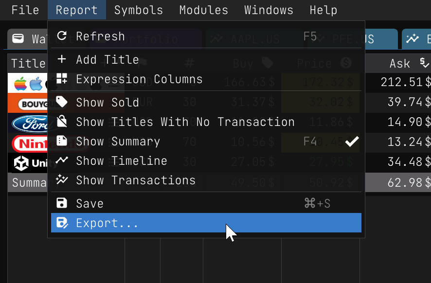
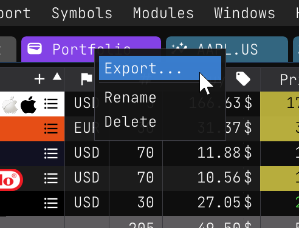
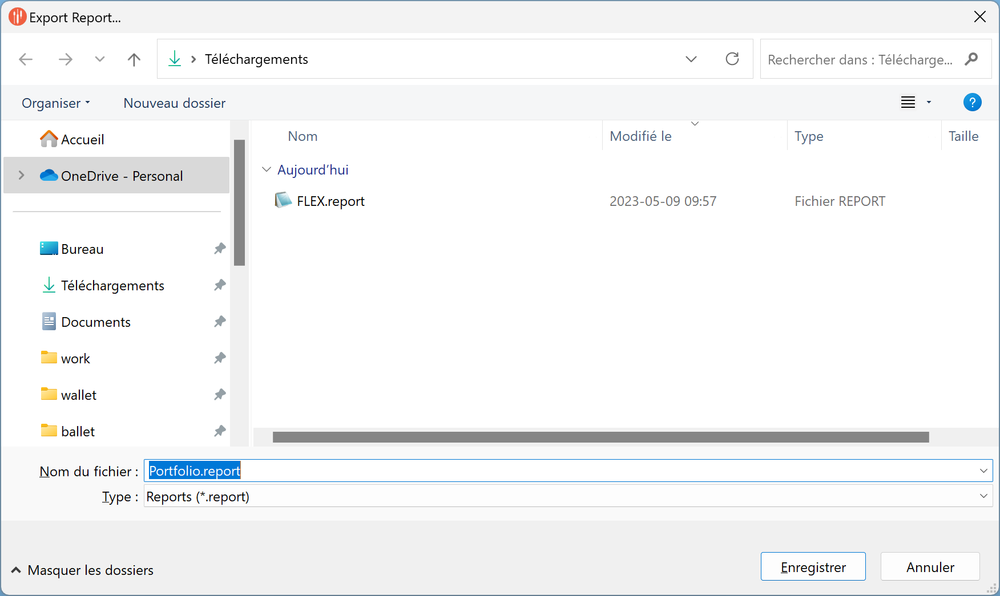

Report Export
=============

It can be useful to export a report to a file, for example, to import it into another account. The following instructions show you how to export a report in JSON format.

## Exporting a Report

1. Click on the `Report` main menu.
2. Click on the `Export...` menu item.
3. Choose the file name and location for your report.
4. Click on the `Save` button to export the report.

|  |  |
|:---:|:---:|
| | |

When the save file dialog is displayed, you can enter the file name you want to use to export the report. Then you can click on the `Save` button to export the report.



Once the report is exported, you can find the file in the folder you selected.

It is important to note that the exported report contains all the transactions. It does not contain the account settings, so it safe to import the report in another account.

## Content of Exported Report

The exported file contains the following information:

- **id**: The ID of the report.
- **name**: The name of the report.
- **wallet**: The wallet settings. All historical data that you track in the wallet is exported. This data is usually displayed in the `Wallet` tab.
- **columns**: Custom expression columns. If you have custom expression columns, they are exported.
- **opened**: The opened state of the report.
- **show_no_transaction_title**: The `No Transaction` title state of the report.
- **show_sold_title**: The `Sold` title state of the report.
- **show_summary**: The `Summary` state of the report.
- **titles**: The transaction orders by title.

The exported file also contains the transactions for each stock symbol. For example, the following transaction is exported for the `AAPL.US` stock symbol:

```json
"AAPL.US": {
  "orders": [
    {
      "date": "2023-04-27",
      "buy": true,
      "sell": false,
      "price": 166.63,
      "qty": 5.00,
      "split": 1.00,
      "xcg": 1.36
    }
  ]
}
```

- **date**: The date of the transaction.
- **buy**: The buy state of the transaction.
- **sell**: The sell state of the transaction.
- **price**: The price of the transaction.
- **qty**: The quantity of the transaction.
- **split**: The split of the transaction if any (default is 1.00).
- **xcg**: The exchange rate of the transaction if the stock is in a different currency than the wallet (default is 1.00).

### [**Portfolio.report:**](/reports/Portfolio.report)

```json
id = "aed6acf1-e512-11ed-90b4-a04a5ed6cd32"
name = "Portfolio"
wallet = {
	funds = [
		{ currency = "CAD" amount = 10000.00 }
	]
	track_history = true
	currency = "CAD"
	show_extra_charts = false
	main_target = 0.250
	history = [
		{ date = "2023-05-09" funds = 10000.00 broker = 0.0000 investments = 5774.11 value = 5784.85 gain = 0.0000 assets = 0.0000 }
	]
}
columns = []
opened = true
show_no_transaction_title = false
show_sold_title = false
show_summary = true
order = 1.00
titles = {
	"AAPL.US" = {
		orders = [
			{ price = 166.63 qty = 5.00 buy = true date = "2023-04-27" split = 1.00 xcg = 1.36 }
		]
	}
	"U.US" = {
		orders = [
			{ date = "2023-04-28" buy = true qty = 30.00 price = 27.05 split = 1.00 xcg = 1.36 }
		]
	}
	"EN.PA" = {
		orders = [
			{ date = "2023-04-28" buy = true qty = 30.00 price = 33.20 split = 1.00 xcg = 1.50 }
		]
	}
	"NTDOY.US" = {
		orders = [
			{ date = "2023-05-01" buy = true qty = 70.00 price = 10.56 split = 1.00 xcg = 1.36 }
		]
	}
	"F.US" = {
		orders = [
			{ date = "2023-05-01" buy = true qty = 70.00 price = 11.88 split = 1.00 xcg = 1.36 }
		]
	}
}
```
