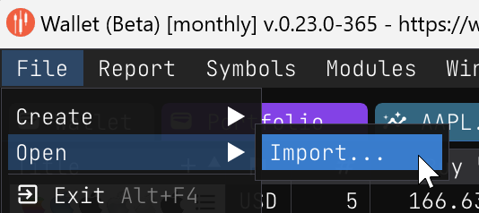
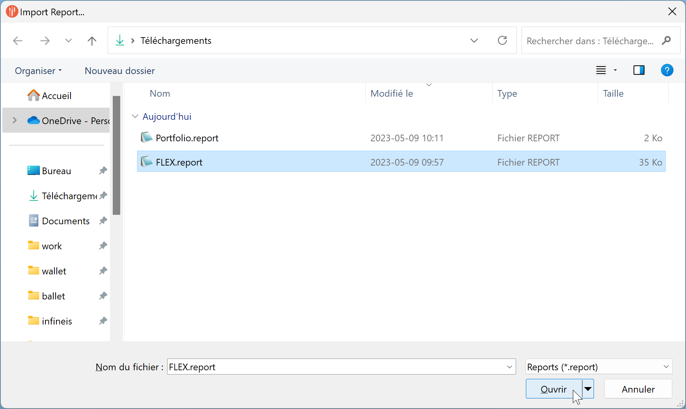
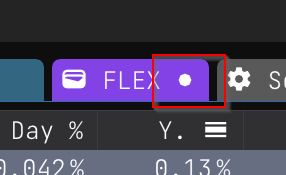
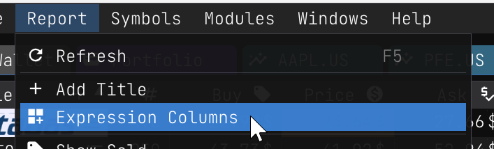
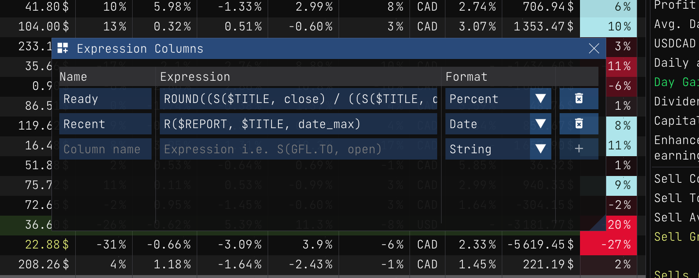
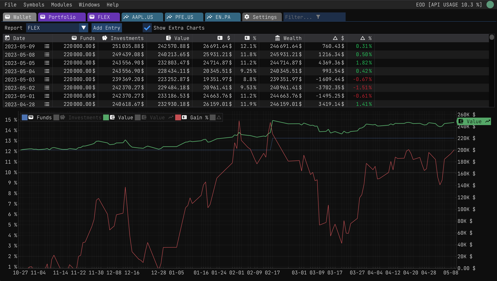

Report Import
=============

If you have [previously exported a report](./report_export.md), you can import it back into the application. This is useful if you want to share a report with someone else or if you want to import a report from another device.

## Importing a Report

Importing a report is easy. Follow these steps:

| |  |
|:---|:---:|
| 1. Click on the `File/Open/Import...` menu item. |  |
| 2. Select the file you want to import from the open file dialog. | |
| 3. Click on the `Open` button to import the report. |  |

| |  |
|:---|:---:|
| When the report is imported, it should get displayed in the application right away. Once imported, you can notice that the report is in a *dirty* state, meaning that you can now officially save it. |  |

You can save the report using the `Report/Save` menu item or by hitting the `Ctrl+S` keyboard shortcut.

## Custom Expressions

The imported report also imports custom expression columns. Sharing reports is a great way to share custom expressions. Custom expressions are explained in the [Custom Expressions](./custom_expressions.md) section.

## Tracking History

When you import a report, the tracking history from the original report is also imported. To view the tracking history of the imported report, go to the Wallet tab.

## Report Location

The report gets imported into your user session folder. By default, you can find the user session folder in the following location:

- MacOS: `$HOME/Wiimag Inc/Wallet/reports`
- Windows: `%LOCALAPPDATA%\Wiimag Inc\Wallet\reports`

Any further edits won't affect the imported file. 

## Example Reports

For your convenience, here are the content of the `Portfolio.report` and `Flex.report` files that were imported:

- <a href="/reports/FLEX.report" download>Flex.report</a>
- <a href="/reports/Portfolio.report" download>Portfolio.report</a>

Enjoy importing and sharing reports!
