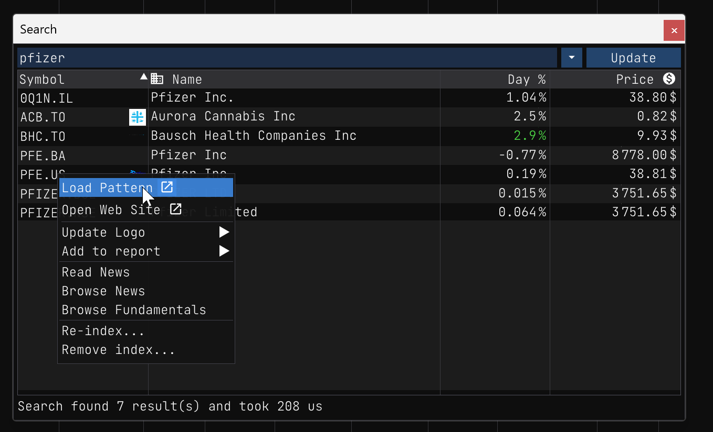
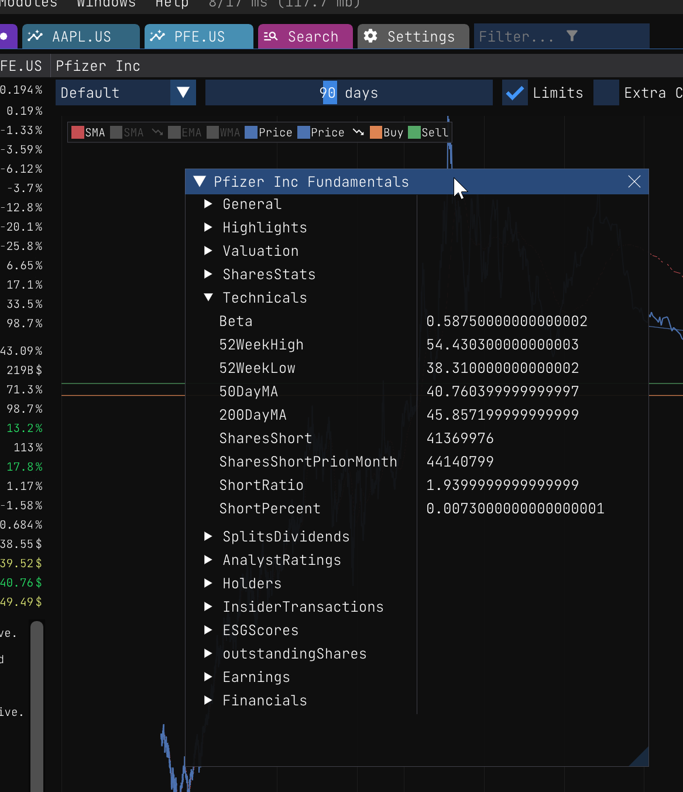
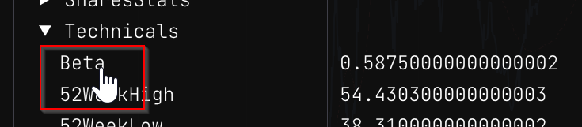

Stock Pattern Fundamentals
==========================

### <a href="https://eodhistoricaldata.com/financial-apis/stock-etfs-fundamental-data-feeds/?ref=PF9TZC2T" target="_blank">API</a>

Welcome to the Stock Pattern Fundamentals guide! As a new investor, it's important to understand how a company is performing before investing. The Wallet app can help you with this by providing a visual representation of a company's fundamentals through a set of charts. However, before we can dive into the charts, it's important to understand what they mean.

To understand how the charts works, you need to understand the fundamentals of a stock. The Wallet app allow the user to visualize the fundamentals using a simple tree view.

To get started, you'll need to open the pattern view for a particular stock. You can access this view from the report or search view.

Once you have the pattern view opened, you can click on the menu item labeled `Pattern/Show Fundamentals` to open the fundamentals view. Here, you'll see a tree view on the left and raw fundamentals values on the right.

It's okay if you don't understand all of the fundamentals at first. You can learn as you go! The Wallet app provides a simple way to get more information about a particular field. 

Simply click on the label of the field you're interested in to bring up a window with more information about that field in the context of the current stock.

The Wallet app will open a little window and display the info about the selected field in context of the current stock.

Ain't that cool? When you're done reading about the field, you can simply click the "X" button to close the window. But since it's so cool, lets show another example.

By understanding a company's fundamentals, you can make informed investment decisions that align with your investment strategy. Let's take a look at an example of how the Wallet app can help you better understand a particular field.

You can find addional information about the [Fundamental Data Explained here](https://eodhistoricaldata.com/financial-apis/fundamental-data-explained/?ref=PF9TZC2T)
