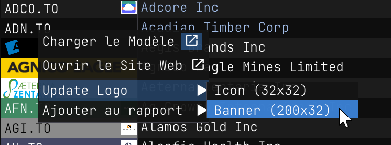
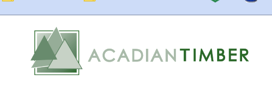
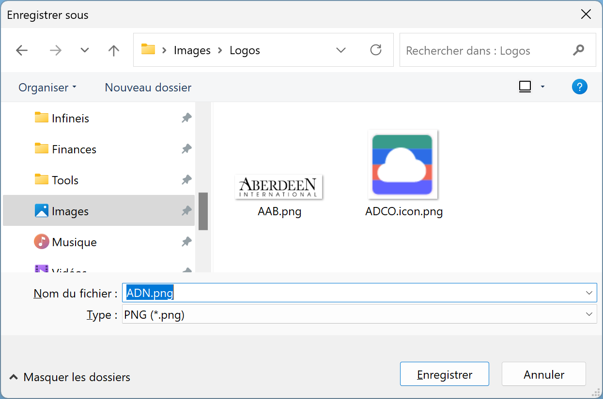
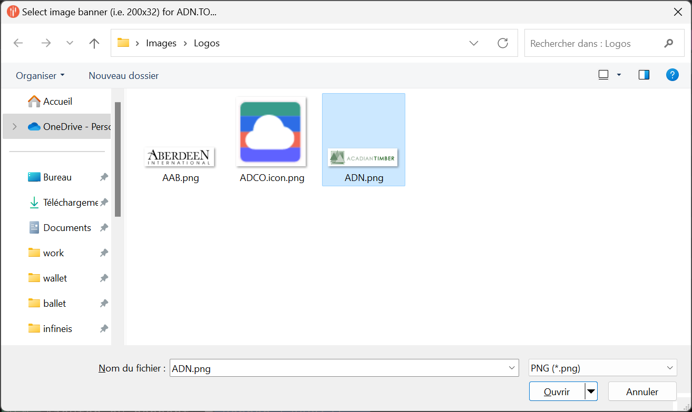
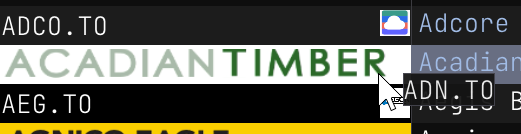

$theme: default
$title: Update symbol icon and banner images

Update symbol icon and banner images
====================================

You can update the symbol icon and banner images. You can use any image you want. But I suggest you use a 64x64 PNG image for the symbol icon and a 400x64 PNG image for the banner.

Anywhere where you see a stock symbol, you right click on it and select `Update Icon/...` to update the symbol icon or banner image.

But first, you usually want to go on the company web site to capture the logo. You can use the tool of your choice to capture the logo. I use [Greenshot](https://getgreenshot.org/). It is free and open source.

So where to find the web site? The same contextual menu as before usually come with a `Go to web site` menu item. Go there and capture the logo.

Save it somewhere on your computer. Then you can right click on the stock symbol and select `Update Icon/...` to update the symbol icon.

Back to the image selection, once you are prompted to select an image, you can select the image you just saved.

Then you can press `Open` to select the image.

Then if everything went well, you should see the new image.

