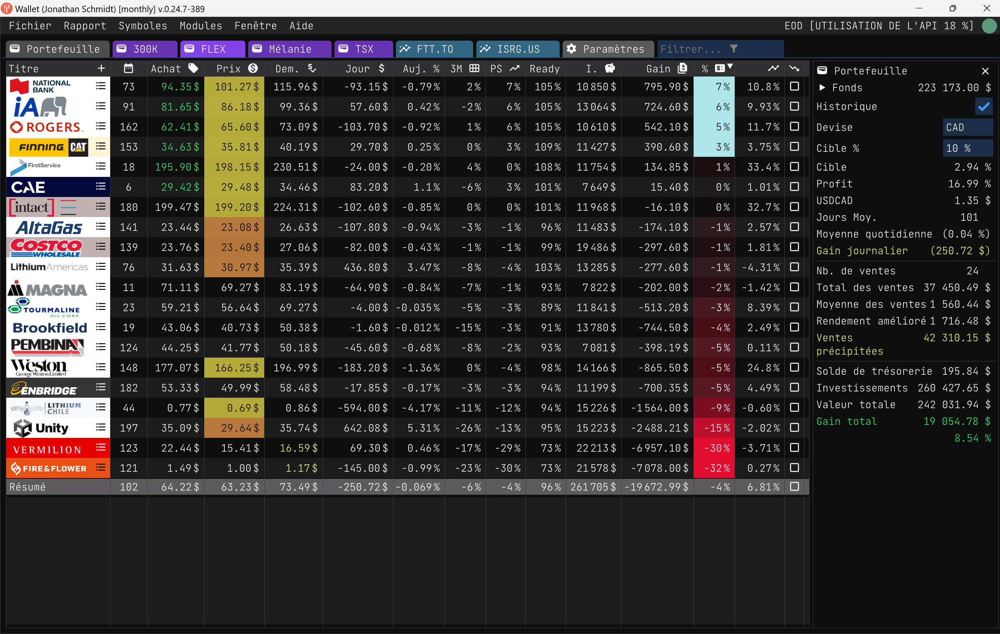
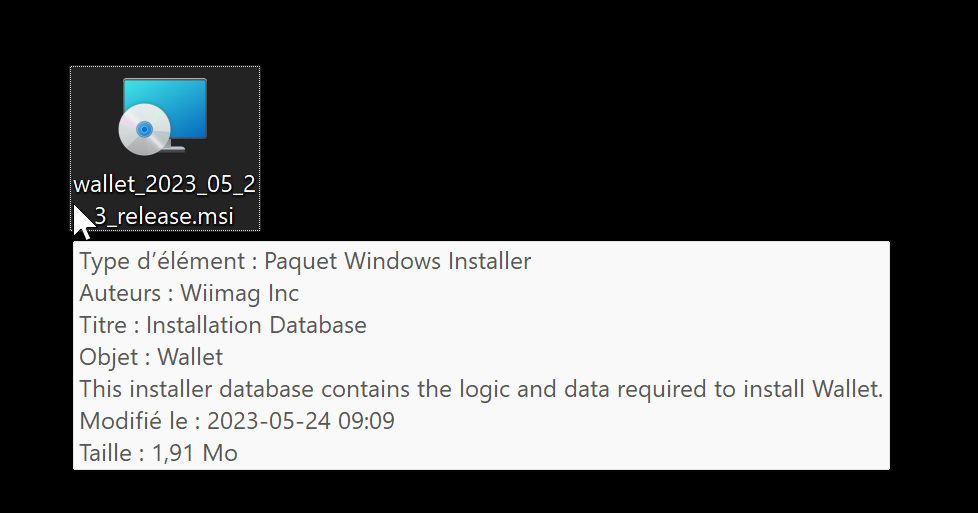
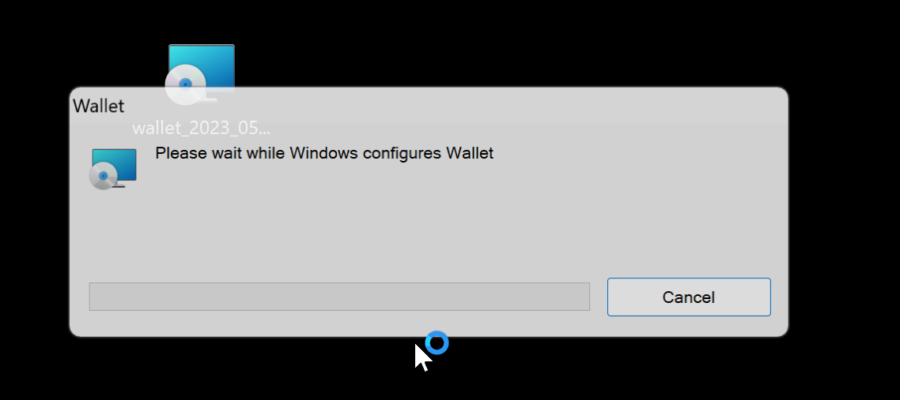
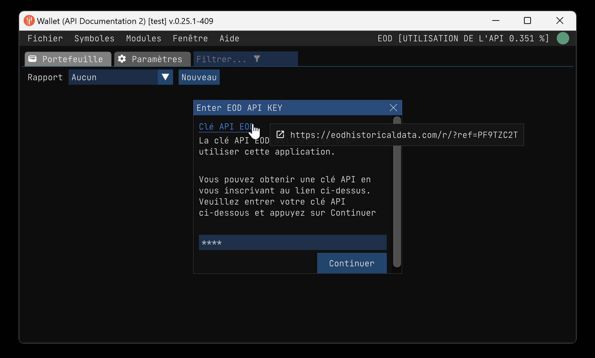
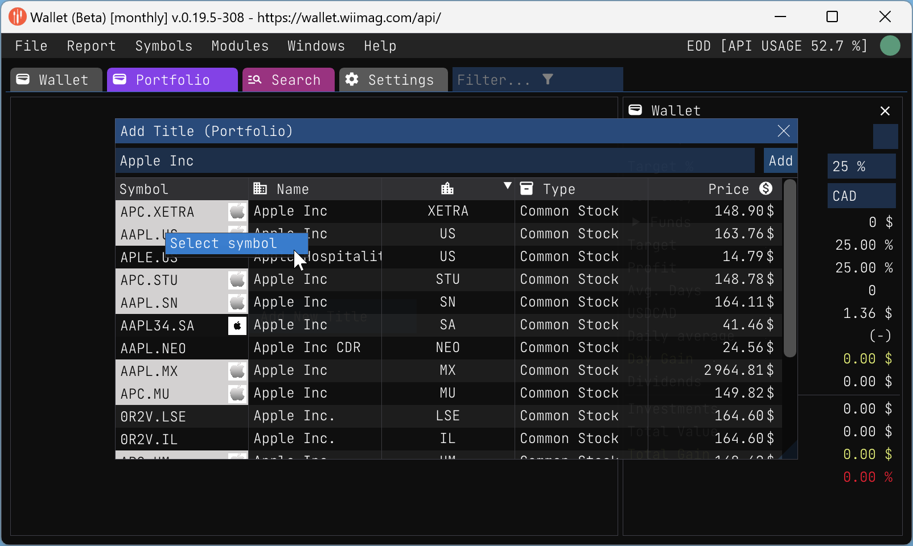
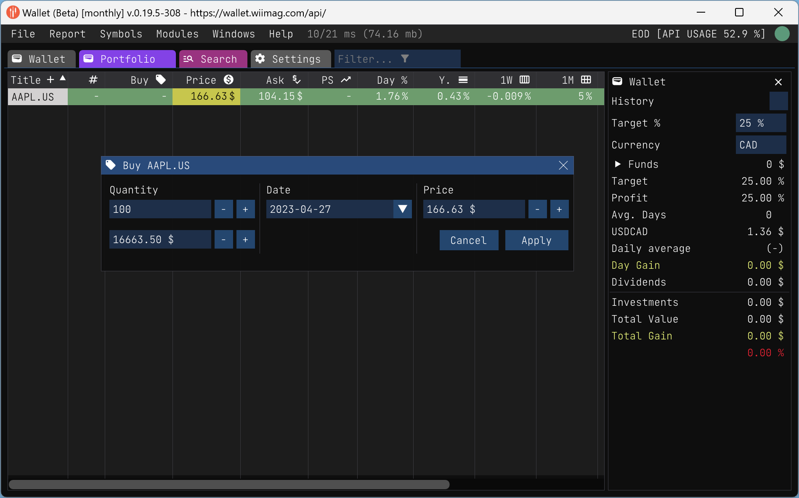

## Table des matières

- [Mise en route](#mise-en-route)
  - [Installation](#installation)
  - [Créer un nouveau rapport](#créer-un-nouveau-rapport)
  - [Ajouter une nouvelle action](#ajouter-une-nouvelle-action)

- [Fonctionnalités](#fonctionnalités)
  - [Rapports](./report.md)
      - [Acheter des actions](buy_stock.md)
      - [Exporter un rapport](report_export.md)
      - [Importer un rapport](report_import.md)
      - [Mettre à jour les îcônes des symboles](update_icon.md)
  - [Symboles](./symbols.md)
      - [Extracteur en masse](./bulk_extractor.md)
  - [Modèles](./pattern.md)
      - [Fondamentaux des modèles boursiers](stock_pattern_fundamentals.md)
  - [Expressions](./expressions.md)
      - [Basic expressions](./expressions.md#basic-functions)
      - [Table expressions](./expressions.md#tabletitle-set-columns)
      - [Plot expressions](./expressions.md#plottitle-x_set-y_set-options)
      - [Stock expressions](./expressions.md#ssymbol-field-date-stock-or-eod)
      - [Report expressions](./expressions.md#rreport-title-field)
      - [Report column expressions](./expressions.md#column-expressions)
      - [Examples](./expressions.md#examples-5)

## Introduction

Vous en avez assez de perdre de l'argent en bourse comme un joueur distrait ? Dites bonjour à l'application Wallet ! Il ne s'agit pas d'un outil de gestion de votre compte bancaire ou de votre carte de crédit - c'est à cela que sert votre banquier (ou votre cochon si vous êtes de la vieille école). Il s'agit plutôt d'une application de bureau conçue pour vous aider à gérer vos actions comme un pro, sans le stress ni la confusion.

Créée par frustration face à l'absence d'un outil de gestion des actions convivial et bon marché, l'application Wallet est née des cendres d'un tableur Google qui était plus lent qu'un escargot un jour de paresse (j'abusais de la fonction `GOOGLEFINANCE` !). Il est portable, rapide et facile à utiliser.

Et le meilleur dans tout ça ? Vous n'avez pas besoin d'être un expert pour utiliser l'application Wallet - elle est parfaite pour les débutants et les investisseurs inexpérimentés ! Elle est conçue pour vous aider à suivre vos actions et vos finances, à apprendre à investir judicieusement et à prendre de meilleures décisions sans avoir l'impression d'avoir besoin d'un diplôme en finance. Alors pourquoi ne pas l'essayer et commencer à devenir un pro de la bourse ?

## Mise en route

### Installation

The Wallet est une application de bureau [portable](/download/portable). Elle est disponible pour Windows et Mac dès à présent. 

Vous pouvez télécharger l'application à partir du [site web](https://wallet.wiimag.com) (<https://wallet.wiimag.com>).

J'utilise WiX pour créer le programme d'installation. L'installateur est une archive auto-extractible, il est possible que votre logiciel antivirus le détecte comme un virus. Ce n'est pas un virus. Il s'agit d'un faux positif.

Mais je ne peux pas vous en vouloir si vous ne me faites pas confiance. Vous pouvez donc télécharger le code source et le compiler vous-même si vous avez accès à <https://github.com/wiimag/wallet>. J'essaierai d'améliorer l'installateur dans le futur, en attendant vous pouvez vérifier l'installateur avec votre logiciel antivirus.

Une fois l'installateur téléchargé quelque part sur votre ordinateur, vous pouvez l'exécuter.

|   |   |
|---|---|
|  |  |

L'application est automatiquement installée sous  `C:\<user home>\AppData\Local\Wallet`. L'application ne nécessite pas de privilèges d'administrateur pour fonctionner.

L'application sera alors installée et lancée automatiquement la première fois.

Voici le premier écran que vous verrez. Vous pouvez cliquer sur le bouton [EOD API Key](https://eodhistoricaldata.com/r/?ref=PF9TZC2T) pour obtenir votre clé API.

Je vous recommande vivement d'obtenir une clé API avec toutes les fonctionnalités. Cela vous coûtera environ 80$ USD par mois. Mais cela en vaut la peine. Dans la plupart des pays, vous pouvez déduire ce coût de vos impôts.

Ok, vous avez votre clé API. Vous pouvez la coller et appuyer sur `Continue`.

Jusqu'ici tout va bien. Vous êtes maintenant prêt à utiliser l'application.

### Créer un nouveau rapport

Lorsque vous créez un nouveau rapport, vous devez choisir un nom pour votre rapport. Vous pouvez choisir le nom que vous voulez, mais je vous suggère de le garder court et simple. Supposons que vous vouliez créer un rapport pour votre portefeuille d'actions. Vous pouvez l'appeler "Portefeuille".

### Ajouter une nouvelle action

Une fois que vous avez créé un nouveau rapport, vous pouvez ajouter un nouveau stock à votre rapport. Vous pouvez ajouter autant d'actions que vous le souhaitez. Mais pour ce guide, nous n'en ajouterons que quelques-unes. Commençons par le classique `AAPL.US` (Apple Inc.).

Une fois que vous avez sélectionné l'action, vous pouvez cliquer sur le bouton "Ajouter". Vous serez alors invité à entrer une première transaction pour ce titre. Vous pouvez cliquer sur "Annuler" si vous ne voulez pas entrer une transaction maintenant. Mais pour cette démonstration, nous allons entrer une transaction.

Appuyez sur "Appliquer" pour enregistrer la transaction. Vous reviendrez ensuite à l'onglet rapport.

