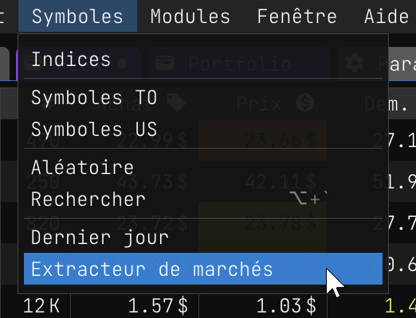
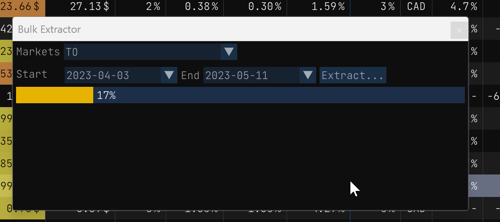
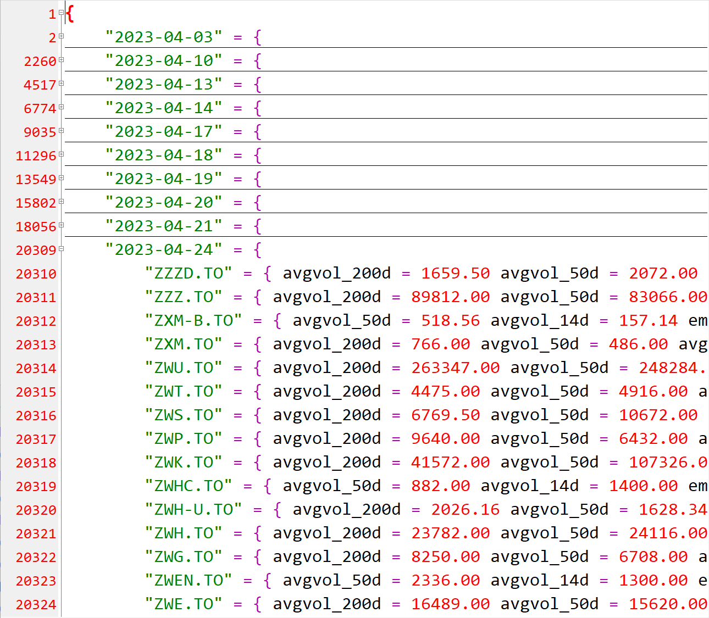

## Extracteur de marchés

L'extracteur de masse est un outil puissant qui vous permet d'extraire efficacement des données d'une liste de symboles. 

À l'aide de l'extracteur en bloc, vous pouvez facilement sélectionner une plage de dates et une liste de symboles (via les marchés offerts). L'outil extraira automatiquement les données pertinentes pour chaque symbole et les enregistrera dans un fichier JSON, organisé par dates. Il est ainsi facile d'importer les données dans un autre outil pour une analyse plus approfondie ou pour créer des visualisations.

Dans l'ensemble, l'extracteur en vrac est un outil essentiel pour tous ceux qui ont besoin d'extraire rapidement et efficacement des données à partir d'une liste de symboles. Son interface intuitive et ses fonctionnalités flexibles en font un atout précieux pour les analystes de données, les traders et les investisseurs.

### Comment utiliser l'extracteur en vrac

|        |         |
|--------|--------:|
| Cet outil est disponible dans le menu `Symboles/Extracteur de marchés`. Cette action ouvrira une nouvelle fenêtre de dialogue dans laquelle vous pourrez configurer les paramètres de l'extraction. |  |

L'extracteur de masse se compose de deux éléments principaux :

- Les marchés dont vous souhaitez extraire les données
- Les dates de début et de fin de l'extraction des données

Une fois ces paramètres configurés, il vous suffit de cliquer sur le bouton `Extraire...` pour lancer le processus d'extraction des données. L'extracteur de marchés va alors automatiquement extraire les données pertinentes pour chaque symbole et les organiser dans un fichier JSON basé sur les dates. Ce fichier peut être facilement importé dans un autre outil pour une analyse plus approfondie des données.

Pour vous tenir informé de la progression de l'extraction, l'extracteur en bloc affiche des mises à jour en temps réel dans la barre d'état située en bas de la fenêtre. Cela vous permet de suivre la progression de l'extraction et d'estimer le temps restant jusqu'à son achèvement.

Dans l'ensemble, l'extracteur de masse est un outil simple mais puissant qui vous permet d'extraire rapidement et efficacement des données de plusieurs marchés pour des dates spécifiques. Son interface conviviale et ses mises à jour de la progression en font un outil précieux pour les traders, les investisseurs et les analystes de données.



Une fois l'extraction terminée, vous pouvez cliquer sur le lien du chemin d'accès au fichier affiché en bas de la fenêtre.

### Aperçu des données extraites

Voici un aperçu des données exportées:



Ce n'est pas toutes les données qui sont exportées pour chaque symbole. Cela dépend des données disponibles pour chaque symbole. Par exemple, si un symbole n'a pas de `ema_50d`, le champ `ema_50d` ne sera pas exporté. Voici un aperçu JSON d'un symbole avec des données disponibles:

```json
"TOU.TO" = { 
    cap = 18957981696.00 
    volume = 2506300.00 
    price = 54.13 
    close = 55.54 
    open = 58.13 
    avgvol_200d = 2273829.50 
    avgvol_50d = 2237870.00 
    avgvol_14d = 1891150.00 
    lo_250d = 50.23 
    hi_250d = 76.88 
    ema_200d = 60.63 
    ema_50d = 57.31 
    low = 55.15 
    high = 58.41 
    beta = 1.60 
}
```

Le fichier exporté généré par l'extracteur de masse contient tous les symboles disponibles avec leurs données correspondantes, organisées par dates. Ces données sont extraites de la base de données <a href="https://eodhistoricaldata.com/financial-apis/bulk-api-eod-splits-dividends/?ref=PF9TZC2T" target=_blank>EOD Historical Data</a> API.

Il est important de noter que la taille du fichier peut rapidement devenir très importante si vous extrayez des données sur une longue période. Veillez donc à disposer de suffisamment d'espace disque et à laisser suffisamment de temps au processus d'extraction pour s'achever.

Malgré la taille potentielle élevée du fichier, l'extracteur en vrac reste un outil précieux pour les analystes de données, les traders et les investisseurs. Il vous permet d'extraire efficacement des données de plusieurs marchés et de les organiser dans un format facile à analyser et à importer dans d'autres outils.
