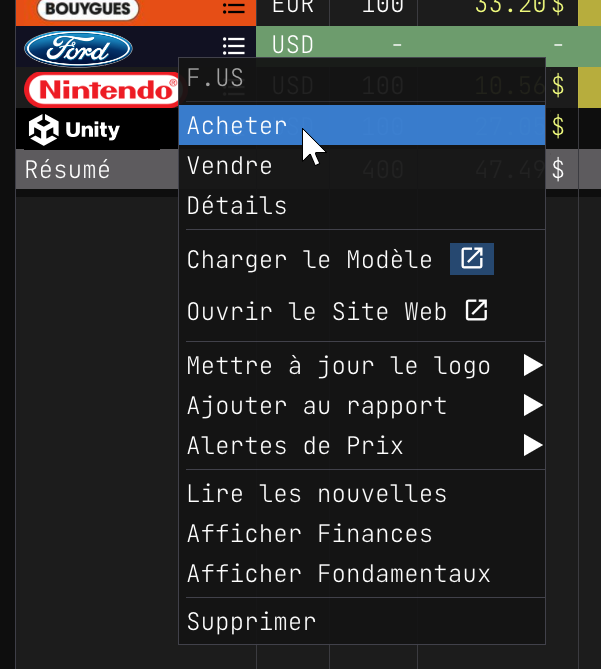
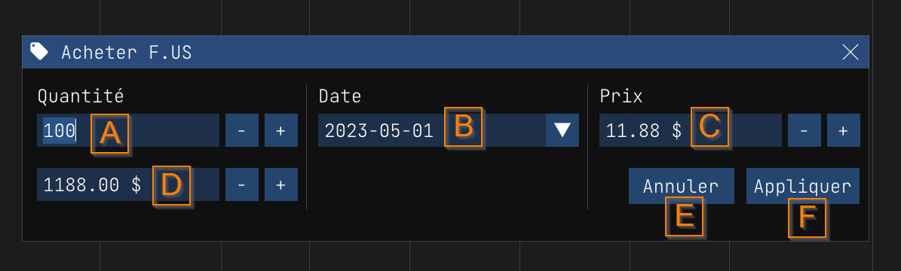
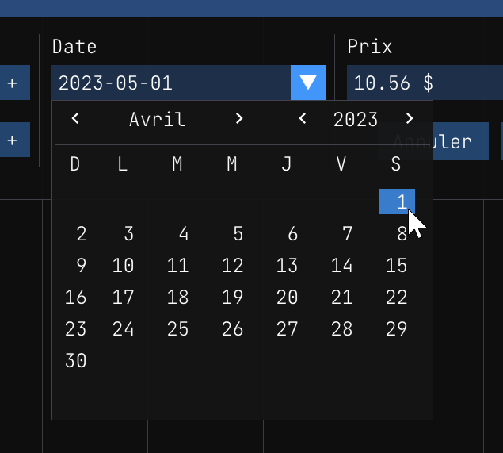
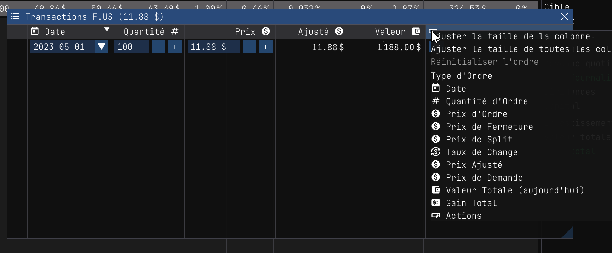

Acheter des actions
===================

Pour enregistrer une transaction d'achat, vous pouvez faire un clic droit sur le symbole de l'action et sélectionner `Acheter`.

Lorsque la boîte de dialogue "Acheter" s'affiche, vous pouvez saisir les détails de la transaction.

Voici la liste des champs :

**Quantité (A)** : Le nombre d'actions que vous avez achetées. Vous pouvez saisir un nombre décimal. Par exemple, si vous avez acheté 10,5 actions, vous pouvez entrer `10.5` dans le champ.

**Date (B)** : La date de la transaction. Le format de la date est "AAAA-MM-JJ". Pour utiliser le sélecteur de date, vous pouvez cliquer sur l'icône de la liste déroulante. Vous pouvez ensuite sélectionner la date de votre choix. Vous pouvez utiliser les flèches de l'en-tête pour modifier le mois et l'année en cours. Lorsque vous modifiez la date sélectionnée, nous mettons à jour le champ **Prix (C)** avec le cours de clôture de la date sélectionnée. 

**Prix (C)** : Le prix de l'action. Vous pouvez saisir un nombre décimal. Par exemple, si vous avez acheté l'action à 100,5 USD, vous pouvez saisir `100.5` dans le champ. Il est important de saisir le prix dans la même devise que le symbole de l'action. Par exemple, si vous avez acheté une action de `AAPL.US` (Apple Inc.), vous devez entrer le prix en USD. Si vous avez acheté une action `AAPL.EUR` (Apple Inc.), vous devez entrer le prix en EUR.

**Total (D)** : Le montant total de la transaction. Le montant total est le prix multiplié par la quantité. Par exemple, si vous avez acheté 10 actions à 100,5 USD, le montant total est de 1005 USD. Vous pouvez également utiliser ce champ pour saisir le montant que vous souhaitez investir. Par exemple, si vous souhaitez investir 1000 USD, vous pouvez saisir "1000" dans le champ. Nous calculerons alors la quantité pour vous. Dans ce cas, la quantité sera de 9,95 actions.

**Annuler (E)** : Vous pouvez cliquer sur le bouton "Annuler" pour annuler la transaction.

**Appliquer (F)** : Vous pouvez cliquer sur le bouton "Appliquer" pour appliquer la transaction.

Lorsque vous avez appliqué la transaction, vous pouvez voir la transaction dans la boîte de dialogue `Détails des transactions` pour confirmer que la transaction a été appliquée correctement.

