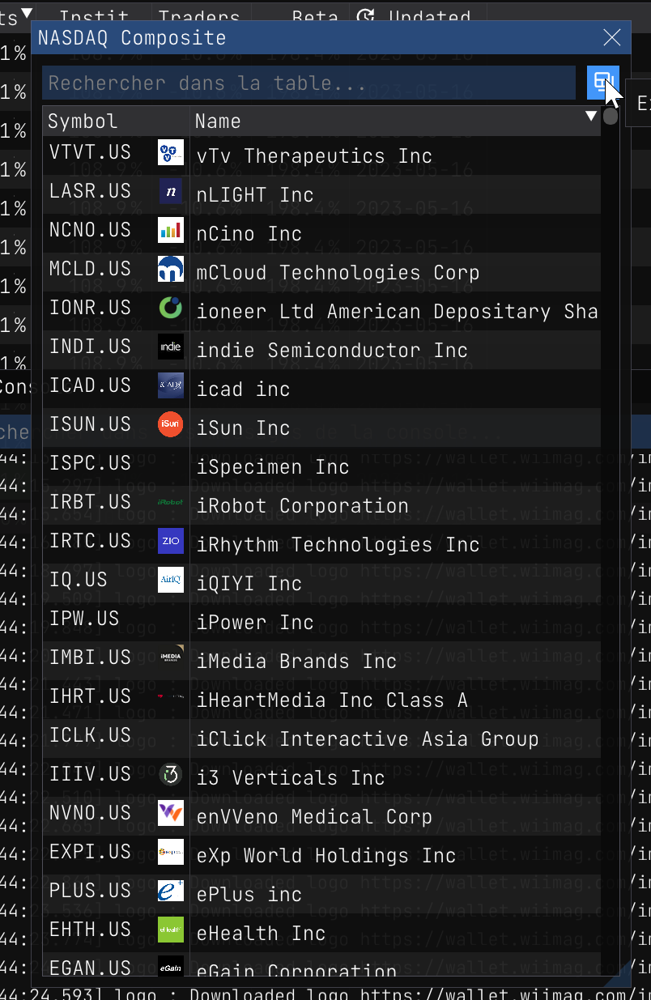
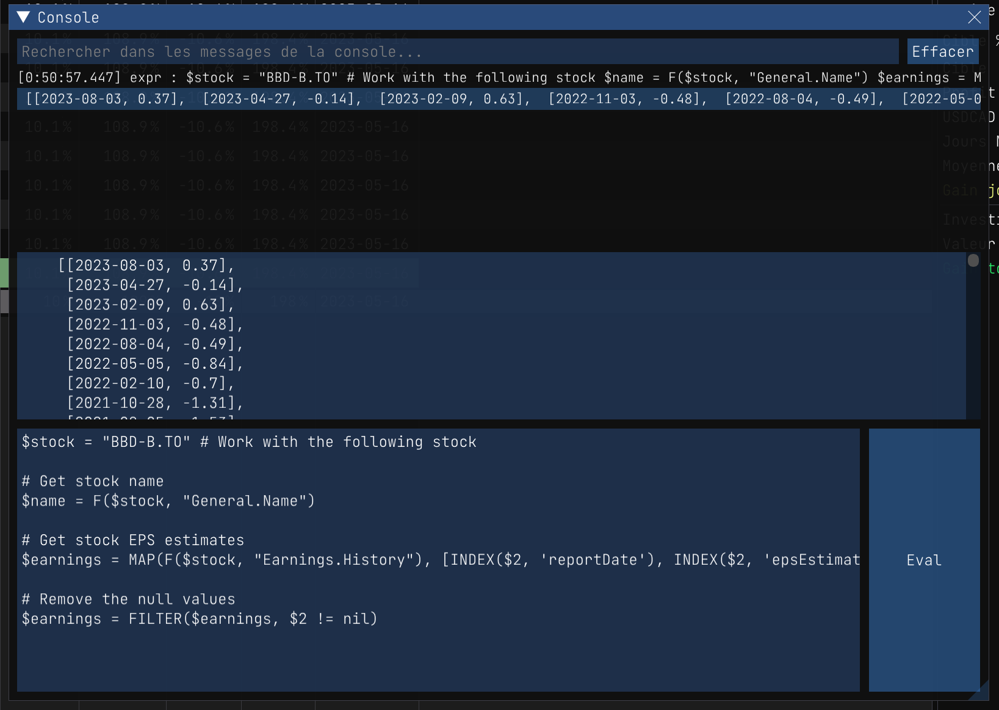

The following page describes the expressions that can be used in the Wallet app. It provides links on how to use them and examples.

# Introduction

An expression is a `string` that is evaluated to obtain a value. The value can be a number, a string, a boolean, or a set of values. Expressions can be used in various contexts:

- In the console window
- Using the `eval(...)` function API
- Using the `--eval` command line option
- Within report column expressions
- When setting up stock alerts

Expressions in this context function similarly to Excel formulas. They can contain constants, operators, functions, and variables. The following sections describe the available functions and variables.

In most cases, an expression calls a registered function, but it can also be a constant or a variable. You can write various mathematical expressions, but it's important to consider operator precedence. Here are a few simple examples:

```js

1+1 == 2
2*3 == 6
2**3 == 8
2**3+1 == 9
(5/4)**3 == 1.953125

MIN(1, 2, 3) == 1
MAX(1, 2, 3) == 3

# ...

```

You can also use `@file_path` to load an expression from a file and have it evaluated. For example:

```js
@C:/Users/John/Documents/expression.expr
```

So this is a simple way to edit and reuse expressions outside of the application console. This way you can also use your favorite text editor to edit expressions.

# Table of Contents

- [Basis](#basis)
	- [Simple expressions](#simple-expressions)
	- [Constants](#constants)
	- [Comments](#comments)
	- [Commas](#commas)
	- [Sets](#sets)
	- [Variables](#variables)
	- [Macros](#macros)
	- [Objects](#objects)
- [Basic Functions](#basic-functions)
  - [MIN(set)](#minset-)
  - [MAX(set)](#maxset-)
  - [SUM(set)](#sumset-)
  - [AVG(set)](#avgset-)
  - [COUNT(set)](#countset)
  - [INDEX(set, index)](#indexset-indexkey)
  - [MAP(set, expression)](#mapset-expression)
  - [FILTER(set, filter)](#filterset-filter)
  - [EVAL(expression)](#evalexpression)
  - [REDUCE(set, expression, initial)](#reduceset-expression-initial)
  - [SORT(set, order, index)](#sortset-order-index)
  - [ROUND(value, precision)](#roundvalue-precision)
  - [FLOOR(value)](#floorvalue)
  - [CEIL(value)](#ceilvalue)
  - [ABS(value)](#absvalue)
  - [RANDOM(lower, upper)](#randomlower-upper-or-rand)
  - [IF(condition, true_expression, false_expression)](#ifcondition-true_expression-false_expression)
  - [WHILE(condition, expression)](#whilecondition-expression)
- [String Functions](#string-functions)
  - [LPAD(text, pad, length)](#lpadvalue-pad-length)
  - [RPAD(text, pad, length)](#rpadvalue-pad-length)
  - [STARTS_WITH(text, prefix)](#starts_withvalue-prefix)
  - [ENDS_WITH(text, suffix)](#ends_withvalue-suffix)
- [Date Functions](#date-functions)
  - [NOW()](#now)
  - [DATE(string)](#datestring)
  - [DATE(year, month, day)](#dateyear-month-day)
  - [DATESTR(timestamp)](#datestrdate)
  - [YEAR(date)](#yeardate)
  - [MONTH(date)](#monthdate)
  - [DAY(date)](#daydate)
- [Stock Functions](#stock-functions)
  - [S(symbol, field, date)](#ssymbol-field-date-stock-or-eod)
  - [R(report, title, field)](#rreport-title-field)
  - [F(symbol, field)](#fsymbol-field)
  - [FIELDS(symbol, api)](#fieldstitle-api)
  - [SEARCH(TEXT)](#searchtext)
- [Graphical Functions](#graphical-functions)
  - [PLOT(title, xset, yset, options)](#plottitle-x_set-y_set-options)
  - [TABLE(title, set, columns)](#tabletitle-set-columns)
- [Examples](#examples-5)

# Basis

## Constants

The following constants are available:

- `true` - the boolean value `true`,
- `false` - the boolean value `false`,
- `null` - the null value,
- `nan` - the not-a-number value,
- `inf` - the infinity value,
- `PI` - the value of PI,
- `HALFPI` - the value of PI/2,
- `TWOPI` - the value of PI*2,
- `SQRT2` - the value of sqrt(2),
- `SQRT3` - the value of sqrt(3),
- `E` - the value of e,
- `LOGN2` - the value of log(2),
- `LOGN10` - the value of log(10),
- `EPSILON` - the value of epsilon,
- `NIL` - the null value.

You simply write the name of the constant in the expression. For example:

```js
PI == 3.141592653589793
(PI*2 == TWOPI) == true
true != false
1/0 == inf
```

## Comments

You can write comments in expressions. A comment starts with a `#` and ends at the end of the line. For example:

```js
# This is a comment
1+1 == 2 # This is also a comment
```

You can also use the `//` comment syntax, but these are only supported at the beginning of the line. For example:

```js
// This is a comment
1+1 == 2
```

Also, note that for technical reasons, an expression should not end with a comment. In example, the following expression is invalid:

```js
1+1 == 2

#TODO: Fix this
```

That is because a comment works like a comma in an expression so ending with a comment is like ending with a comma. So the expression is invalid because it is equivalent to writing:

```js
5+6,
```

## Commas

Comma are used to separate values in a set. A newline works like a comma. For example:

```js
5+6
7+8
```

Is equivalent to:

```js
5+6, 7+8
```

Which returns the set of values:

```js
[11, 15]
```

## Sets

Expressions can be used to create sets of values. A set is a list of values separated by commas and enclosed in square brackets. For example:

```js
[1, 2, 3] == [1, 2, 3]
[1, 2, 3] != [1, 2, 4]
```

Most functions consumes sets of values. For example:

```js
# The SUM(...) function returns a number
SUM([1, 2, 3, 4, 5, 6, 7, 8, 9, 10]) == 55

# The COUNT(...) function returns a number
COUNT([1, 2, 3, 4, 5, 6, 7, 8, 9, 10]) == 10

# Repeat 1 ten times and sum the values
# REPEAT is a function that returns a set of values
# SUM is a function that consumes a set of values
SUM(REPEAT(1, 10)) == 10
```

And some functions, such as `MAP(...)` and `FILTER(...)`, also returns sets of values.

## Variables

You can define variables in expressions. A variable is a name that starts with a dollar sign `$`. For example:

```js
$name = "John"
$age = 30

$result = "My name is " + $name + " and I am " + $age + " years old."
```

Variables are always defined globally. This means that they are available in all expressions. For example:

```js
$a = 55

# The variable $a is available in the following expression
$b = $a + 10
```

Then later, unless the variable is redefined, it will still be available:

```js
# The variable $a is still available
$c = $a + 20
```

**Important:** Note that sets stored in variables are deallocated when once the evaluation is over. So they cannot be used in other expression evaluation sessions.

## Macros

Also it is important to note that `$1, $2, $3`, etc. are usually reserved within functions. So you should not use them as global variable names. The system usually assigns values to these variables when calling inner functions. In example, in the `MAP(...)` function, the `$1` variable is assigned the value of the current item in the set being iterated. The following example illustrates this:

```js
# Sets some values
$values = [1, 2, 3, 4, 5]

# For each value in the set, multiply it by 2
# The $1 variable is assigned the value of the current item in the set
$multiplied = MAP($values, $1 * 2)

# The result is [2, 4, 6, 8, 10]
$multiplied == [2, 4, 6, 8, 10]
```

So now if the `MAP(...)` input sets is a set of sets, the `$1` variable will be assigned to the first item of the inner set. The `$2` variable will be assigned to the second item of the inner set, and so on. The following example illustrates this:

```js
# Sets some values [name, age]
$values = [['Marco', 30], ['John', 40], ['Mary', 50]]

# For each value in the set, combine the name and age to form a phrase like "Marco is 30 years old"
$phrases = MAP($values, $1 + " is " + $2 + " years old")

# The result is ["Marco is 30 years old", "John is 40 years old", "Mary is 50 years old"]
$phrases == ["Marco is 30 years old", "John is 40 years old", "Mary is 50 years old"]
```

### Macro functions

Variables can be used to store values, but they can also be used to store functions. For example:

```js
# Define a function that returns the sum of two numbers
# Each arguments can be accessed using the $1, $2, $3, etc. variables
$(a, $1 + $2)

# Call the function
$result = a(1, 2)

# The result is 3
$result == 3
```

When you invoke `a` each argument is assigned to the `$1`, `$2`, `$3`, etc. variables. So the function can access the arguments using these variables. 

## Objects

Objects are sets of `[[key, value], ...]` pairs. The keys are usually string constants and the values can be any expression. Since this expression language only use sets, then objects are represented as sets of key/value pairs. For example:

```js
# Map the values to an object, i.e. {name: 'Marco', age: 30}
$object = [['name', 'Marco'], ['age', 30]]
```

# Basic Functions

Basis covered! Now lets get to the good stuff. The following sections describe the basic functions available in the expression language.

---------------------------------------------------------------------------
## `MIN(set, ...)`

* `set` - A set of values, i.e. `[1, 2, 3, 4, 5]`
* `...` - Additional sets of values, i.e. `[1, 2, 3], [4, 5, 6]`
* ***Returns*** the minimum value in all sets.

The `MIN(...)` function is used to get the minimum value in a set. The first argument is the set of values. For convenience, you can also pass multiple arguments instead of a set. The following examples illustrate the use of the `MIN(...)` function:

### Examples

```js
# Get the minimum value in a set
MIN([1, 2, 3, 4, 5]) == 1

# Get the minimum value for all the arguments
MIN(1, 2, 3, 4, 5) == 1

# Get the minimum value with all set arguments
MIN([1, -2, 3], [4, 5, 6]) == -2
```

Remember you can pass any expression as an argument. For example:

```js
$(fun, RAND(1, 100))
MIN(REPEAT(fun(), 10))
```

Will return the minimum value of 10 random numbers between 1 and 100.

### Use case:  `MIN($holders)`

Given `VTNR.US`, lets pretend we want to find the holder name with the less total shares. We can do this by using the `MIN(...)` function. The following expression will return the holder name with the less total shares:

```js
$symbol = "VTNR.US"

# Get all institutional holders
$holders = F($symbol, "Holders.Institutions")

# Since the data is mapped as an object array "0": {...}, "1": {...}, etc.
# We need to convert it to a set of values by indexing each object by its key
$holders = MAP($holders, [INDEX($2, 'name'), INDEX($2, 'totalShares')])

# Now we should have something like this: [[State Street Corporation, 12.0769], [BlackRock Inc, 5.1746], [Vanguard Group Inc, 4.8573], ...]
MIN($holders)
```

|  |  <div style="width:200px"></div> |
|:---|---:|
| This example use uncovered functions, but it is just to illustrate the use of `MIN(...)` in a real case scenario. You can learn more about these below: | - [F(...)](#fsymbol-field) - Extract fundamental data for a stock symbol. <br /> - [MAP(...)](#mapset-expression) - Map a set of values to another set of values. <br /> - [INDEX(...)](#indexset-indexkey) - Get the value of a key in a set. |

The result is `["State Street Corporation", 12.0769]` as of 2023-05-25.

How does `MIN(...)` knows to compare the second item in the set? Well, it is because the each sets can have a index defined to be the default comparison value. In this case, when the `MAP(...)` function is called, second argument is a set of two items. The first item is the name of the holder, and the second item is the total shares. So the `MAP` functions usually consider the last value of a set to be the default comparison value. So in this case, the `MIN(...)` function will compare the total shares.

> **Important:** Not all functions use the last value of a set as the default comparison value. So when in doubt, check the documentation of the function or set the first argument to be the default comparison value. For example we could of map the values like this `[INDEX($2, 'totalShares'), INDEX($2, 'name')]` flipping the order of the values. Then the `MIN(...)` function will compare the total shares.

---
## `MAX(set, ...)`

* `set` - A set of values, i.e. `[1, 2, 3, 4, 5]`
* `...` - Additional sets of values, i.e. `[1, 2, 3], [4, 5, 6]`
* ***Returns*** the maximum value in all sets.

The `MAX(...)` function is used to get the maximum value in a set. The first argument is the set of values. For convenience, you can also pass multiple arguments instead of a set. The following examples illustrate the use of the `MAX(...)` function:

### Examples

```js
$values = [1, 2, 3, 4, 5]

# Get the min/max range of values
$minmax = [MIN($values), MAX($values)]

# The result is [1, 5]
$minmax == [1, 5]
```

### Use case: `MAX($insider_transactions)` 

Given `U.US`, lets find the biggest insider transaction. We can do this by using the `MAX(...)` function. The following expression will return the biggest insider transaction:

**Uncovered functions:**
- [F(...)](#fsymbol-field) - Extract fundamental data for a stock symbol. 
- [MAP(...)](#mapset-expression) - Map a set of values to another set of values. 
- [INDEX(...)](#indexset-indexkey) - Get the value of a key in a set.

```js
# Symbol to use
$symbol = "U.US"

# Lets get the insider transactions data
$insider_transactions = F($symbol, "InsiderTransactions")

# Map the data so we have the name and the value of the transaction
$insider_transactions = MAP($insider_transactions, [
	INDEX($2, 'transactionDate'), 
	INDEX($2, 'ownerName'), 
	INDEX($2, 'transactionAmount') * INDEX($2, 'transactionPrice')])

MAX($insider_transactions)
```

You will get something like this `[2023-03-31, Tomer Bar-Zeev, 2.4255e+06]` as of 2023-05-25.

---
## `SUM(set, ...)`

* `set` - A set of values, i.e. `[1, 2, 3, 4, 5]`
* `...` - Additional sets of values, i.e. `[1, 2, 3], [4, 5, 6]`
* ***Returns*** the sum of all values in all sets.

The `SUM(...)` function is used to get the sum of values in a set. The first argument is the set of values. For convenience, you can also pass multiple arguments instead of a set. The following examples illustrate the use of the `SUM(...)` function:

### Examples

```js
# Get the sum of values in a set
SUM([1, 2, 3, 4, 5]) == SUM(1, 2, 3, 4, 5) == 15
```

Invalid values are usually ignored. For example:

```js
# nan is not a valid number and will be ignored
SUM([1, 2, 3, nan, 5]) == 11
```

### Use case: `SUM($dividends)`

Lets pretend we want to sum all the number of dividends paid each year for `MSFT.US`. We can do this by using the `SUM(...)` function. The following expression will return the sum of all the dividends paid by all the holders:

**Uncovered functions:**
- [F(...)](#fsymbol-field) - Extract fundamental data for a stock symbol. 
- [MAP(...)](#mapset-expression) - Map a set of values to another set of values. 
- [INDEX(...)](#indexset-indexkey) - Get the value of a key in a set.

```js
# Symbol to use
$symbol = "MSFT.US"

# Lets get the number of dividends paid by each year
$dividends = MAP(F($symbol, "SplitsDividends.NumberDividendsByYear"), INDEX($2, 'Count'))

# Sum all the dividends
SUM($dividends)
```

As of 2023-05-25, the result is about `78`.

---
## `AVG(set, ...)`

* `set` - A set of values, i.e. `[1, 2, 3, 4, 5]`
* `...` - Additional sets of values, i.e. `[1, 2, 3], [4, 5, 6]`
* ***Returns*** the average of all values in all sets.

The `AVG(...)` function is used to get the average of values in a set. The first argument is the set of values. For convenience, you can also pass multiple arguments instead of a set. The following examples illustrate the use of the `AVG(...)` function:

### Examples

```js
# Get the average of values in a set
AVG([1, 2, 3, 4, 5]) == AVG(1, 2, 3, 4, 5) == 3
```

### Use case: `ROUND(AVG($ages))`

Lets pretend we want to get the average age of all `Officers` for `ZM.US`. We can do this by using the `AVG(...)` function. The following expression will return the average age of all the officers:

| **Referenced functions** | Description |
| :--- | ---: |
| [F(...)](#fsymbol-field) | Extract fundamental data for a stock symbol. |
| [MAP(...)](#mapset-expression) | Map a set of values to another set of values. |
| [FILTER(...)](#filterset-filter) | Filter a set of values by an expression. |
| [INDEX(...)](#indexset-indexkey) | Get the value of a key in a set. |
| [YEAR(...)](#yeardate) | Get the year of a date. |
| [NOW()](#now) | Get the current date. |
| [ROUND(...)](#roundvalue-precision) | Round a value to a given precision. |

```js
# Symbol to use
$symbol = "ZM.US"

# Lets get the officers data
$officers = MAP(F($symbol, "General.Officers"), $2)

# Lets get the age of each officer
$YearBorn = FILTER(MAP($officers, INDEX($3, 1)), $1)

# Lets get the average age
$YEAR = YEAR(NOW())
$ages = MAP($YearBorn, $YEAR - $1)
ROUND(AVG($ages))
```

As of 2023-05-25, the result is about `50`.

---
## `COUNT(set)`

* `set` - A set of values, i.e. `[1, 2, 3, 4, 5]`
* ***Returns*** the number of values in the set.

The `COUNT(...)` function is used to get the number of values in a set. The first argument is the set of values. The following examples illustrate the use of the `COUNT(...)` function:

### Examples

```js
# Get the number of values in a set
COUNT([1, 2, 3, 4, 5]) == 5

# Enumerate 50 ones and get the count, surprisingly it is 50!
COUNT(REPEAT(1, 50)) == 50
```

### Use case: `COUNT($sectors)`

You are on duty and you are asked to count how many sector `ARKK.US` as equity in? That's easy:

| **Referenced functions** | Description |
| :--- | ---: |
| [F(...)](#fsymbol-field) | Extract fundamental data for a stock symbol. |
| [MAP(...)](#mapset-expression) | Map a set of values to another set of values. |
| [FILTER(...)](#filterset-filter) | Filter a set of values by an expression. |
| [INDEX(...)](#indexset-indexkey) | Get the value of a key in a set. |

```js
# Symbol to use
$symbol = "ARKK.US"

# Lets get the sector data
$sectors = MAP(F($symbol, "ETF_Data.Sector_Weights"), [$1, INDEX($2, 'Equity_%')])

# Now lets exclude the sectors that have 0% equity
$sectors = FILTER($sectors, $2 > 0)

# Now lets count the number of sectors
COUNT($sectors)
```

As of 2023-05-25, the result is `6`. Duty done!

---
## `INDEX(set, index|key)`

* `set` - The set of values to be indexed.
* `index` - The 0-based index of the value to be returned in the set.
* `key` - The key name of the value to be returned in the set in case the set is mapped as an [object](#objects).
* ***Returns*** the value at the specified index or key.

The `INDEX(...)` function is used to get a value from a set. The first argument is the set of values, and the second argument is the index or key. If you want to get the first value in the set, you can use `INDEX($set, 0)`. If you want to get the last value in the set, you can use `INDEX($set, -1)`. If you want to get the value of a key in an object, you can use `INDEX($set, "key")`. The following examples illustrate the use of the `INDEX(...)` function:

### Examples

#### Index by position

```js
# Get the first value in a set
$values = [1, 2, 3, 4, 5]

# Get the first value
INDEX($values, 0) == 1

# Get the last value
INDEX($values, -1) == 5

# Get the middle value
INDEX($values, FLOOR(COUNT($values) / 2)) == 3
```

#### Index by key

```js
# Declare an object
$obj = [[name, "John"], [age, 30]]

# Get the name
$name = INDEX($obj, "name")

# Get the age
$age = INDEX($obj, "age")

[$name, $age] == ["John", 30]
```

---
## `MAP(set, expression)`

* `set` - The set of values to be mapped, i.e. `[1, 2, 3, 4, 5]`
* `expression` - The expression to be evaluated for each value in the set to produce the mapped value set, i.e. `$1 * 2`
* ***Returns*** the mapped set of values.

The `MAP(...)` function is used to transform a set of values into another set of values. The first argument is the set of values, and the second argument is the expression to be evaluated for each value in the set. The expression can be any expression that returns a value. The expression is evaluated with the [`$1, $2, $3, ...` macros](#macros) set to the value of the current value in the set. The following examples illustrate the use of the `MAP(...)` function:

### Examples

```js
# Map a set of values to another set of values
MAP([1, 2, 3, 4, 5], $1 * 2) == [2, 4, 6, 8, 10]

# Map a set of values to another set of values
MAP([[name, 'Joe'], [age, 30]], $2) == ['Joe', 30]
```

### Use case: `MAP(F("AAPL.US", "General.Officers"), INDEX($2, 'Name'))`

The `MAP(...)` is used for many scenarios when fetching stock fundamentals. For example, lets say we want to get the names of all the officers for `ZM.US`. We can do this by using the `MAP(...)` function.

| **Referenced functions** | Description |
| :--- | ---: |
| [F(...)](#fsymbol-field) | Extract fundamental data for a stock symbol. |
| [INDEX(...)](#indexset-indexkey) | Get the value of a key in a set. |

```js
# Lets get the names of each officer
MAP(F("AAPL.US", "General.Officers"), INDEX($2, 'Name'))
```

As of 2023-05-25, the result is:

```
	[Mr. Timothy D. Cook,
	 Mr. Luca  Maestri,
	 Mr. Jeffrey E. Williams,
	 Ms. Katherine L. Adams,
	 Ms. Deirdre  O'Brien,
	 Mr. Chris  Kondo,
	 Mr. James  Wilson,
	 Ms. Mary  Demby,
	 Ms. Nancy  Paxton,
	 Mr. Greg  Joswiak]
```

---
## `FILTER(set, filter)`

* `set` - The set of values to be filtered, i.e. `[1, 2, 3, 4, 5]`
* `filter` - The filter expression to be evaluated for each value in the set to produce the filtered value set, i.e. `$1 > 3`
	* `$1...$n` - The indexed value in the current element in the set.
* ***Returns*** the filtered set of values.

The `FILTER(...)` function is used to filter a set of values. The first argument is the set of values, and the second argument is the filter expression. The filter expression is usually an assertion that return true or false. If the assertion is true, the value is kept in the set. If the assertion is false, the value is removed from the set. The filter expression can be any expression that returns a boolean value. The following examples illustrate the use of the `FILTER(...)` function:

### Examples

```js
// Keep only the values that are greater than 10
FILTER([1, 2, 3, 4, 5, 6, 7, 8, 9, 10], $1 > 5) == [6, 7, 8, 9, 10]
```

### Use case: `FILTER($price_change, $2 > 10)`

Lets get all the end of day where the price change for `GLF.TO` was greater than 10%. We can do this by using the `FILTER(...)` function. The following expression will return the end of day where the price change was greater than 10%:

| **Referenced functions** | Description |
| :--- | ---: |
| [S(...)](#ssymbol-field-date-stock-or-eod) | Get the end of day data for a stock symbol. |
| [MAP(...)](#mapset-expression) | Map a set of values to another set of values. |
| [DATESTR(...)](#datestrdate) | Format a date to a string. |
| [FILTER(...)](#filterset-filter) | Filter a set of values by an expression. |

```js
# Symbol to use
$symbol = "GFL.TO"

# Get the end of day data
$eod = S($symbol, open, ALL)

# Remap the data to get the price change
$price_change = MAP($eod, [DATESTR($1), (S($symbol, close, $1) - $2) / $2 * 100])

# Filter the data to get the price change greater than 10%
FILTER($price_change, $2 > 10)
```

Turns out that as for 2023-05-25 its only happend [once](/eod/GFL.TO?period=d):

```
[[2020-04-09, 10.2271]]
```

---
## `EVAL(expression)`

* `expression` - The expression to be evaluated, i.e. `1 + 2`
* ***Returns*** the result of the expression.

The `EVAL(...)` function is used to evaluate an expression. The expression can be any expression that returns a value. This function is mainly useful when another function expects a function argument to be applied as an expression which is really __meta__ and rarely used.

### Examples

Lets say you are given a string that could be an expression, and you want to evaluate it. You can do this by using the `EVAL(...)` function. The following expression will return the result of the expression:

```js
$outer_world_expression = "1 + 2"

EVAL($outer_world_expression) == 3
```

---
## `REPEAT(expression, count)`

* `expression` - The expression to be evaluated, i.e. `1 + 2`
	* `$i` - The current index of the expression, i.e. `1 + 2 * $i`
	* `$COUNT` - The current count of the expression, i.e. `1 + 2 * $COUNT`
* `count` - The number of times to repeat the expression
* ***Returns*** the result set of the `count` number of expressions.

The `REPEAT(...)` function is used to repeat an expression a number of times. The expression can be any expression that returns a value. The following examples illustrate the use of the `REPEAT(...)` function:

### Examples

```js
# Repeat the expression 5 times
REPEAT(1 + 2, 5) == [3, 3, 3, 3, 3]

# Repeat the expression 5 times
REPEAT($i, 5) == [0, 1, 2, 3, 4]
```

---
## `REDUCE(set, expression, initial)`

* `set` - The set of values to be reduced, i.e. `[1, 2, 3, 4, 5]`
* `expression` - The expression to be evaluated for each value in the set to produce the reduced value, i.e. `$1 + $2`
	* `$0` - The current reduced value.
	* `$1...$n` - The indexed value in the current element in the set.
* `initial` - The initial value to be used for the reduced value, i.e. `5`
	* If `initial` is not provided, the first value in the set is used as the initial value.
* ***Returns*** the reduced value.

The `REDUCE(...)` function is used to reduce a set of values to a single value. The first argument is the set of values, the second argument is the expression, and the third argument is the initial value. The expression is usually an operation that returns a value. The expression is evaluated for each value in the set to produce the reduced value. The following examples illustrate the use of the `REDUCE(...)` function:

### Examples

```js
# Sum all the values in the set
REDUCE([1, 2, 3, 4, 5], $0 + $1, 0) == 15

# Automatically apply the second argument function with $0 and $1
REDUCE([1, 2, 3, 4, 5], ADD, 0) == 15
```

---
## `SORT(set[, order, index])`

* `set` - The set of values to be sorted, i.e. `[3, 2, 4, 1, 5]`
* `order` - The order to sort the set, i.e. `ASC` or `DESC`
	* `ASC` - Sort the set in ascending order.
	* `DESC` - Sort the set in descending order.
* `index` - The index of the value in the element set to sort by, i.e. `1`. This is useful when the element is an [object set](#object).
* ***Returns*** the sorted set of values.

The `SORT(...)` function is used to sort a set of values. The first argument is the set of values, the second argument is the order, and the third argument is the index. The order can be `ASC` or `DESC`. The index is the index of the value in the element set to sort by. This is useful when the element is an [object set](#object). The following examples illustrate the use of the `SORT(...)` function:

### Examples

```js
# Sort the set in ascending order
SORT([3, 2, 4, 1, 5], ASC) == [1, 2, 3, 4, 5]

# Sort the set in descending order
SORT([3, 2, 4, 1, 5], DESC) == [5, 4, 3, 2, 1]

# Sort the set in ascending order by the second value in the element set
SORT([[1, 3], [2, 2], [3, 4], [4, 1], [5, 5]], ASC, 1) == [[4, 1], [2, 2], [1, 3], [3, 4], [5, 5]]
```

---
## `ROUND(value, precision)`

* `value` - The value to be rounded, i.e. `1.234`
* `precision` - The precision to round the value in decimal places, i.e. `2`
	* If a positive number is provided, the value is rounded to the specified number of decimal places.
	* If a negative number is provided, the value is rounded to the left of the decimal point.
		* i.e. `-1` rounds to the nearest 10, `-2` rounds to the nearest 100, etc.
* ***Returns*** the rounded value.

The `ROUND(...)` function is used to round a value to a precision. The first argument is the value, and the second argument is the precision. The following examples illustrate the use of the `ROUND(...)` function:

### Examples

```js
# Round the value to 2 decimal places
ROUND(1.234, 2) == 1.23

# Round the value to 1 decimal place
ROUND(1.234, 1) == 1.2
```

---
## `FLOOR(value)`

* `value` - The value to be rounded down, i.e. `1.234`
* ***Returns*** the rounded down value.

The `FLOOR(...)` function is used to round a value down. The first argument is the value. The following examples illustrate the use of the `FLOOR(...)` function:

### Examples

```js
# Round the value down
FLOOR(1.234) == 1
```

---
## `CEIL(value)`

* `value` - The value to be rounded up, i.e. `1.234`
* ***Returns*** the rounded up value.

The `CEIL(...)` function is used to round a value up. The first argument is the value. The following examples illustrate the use of the `CEIL(...)` function:

### Examples

```js
# Round the value up
CEIL(1.234) == 2
```

---
## `ABS(value)`

* `value` - The value to be converted to an absolute value, i.e. `-1.234`
* ***Returns*** the absolute value.

The `ABS(...)` function is used to convert a value to an absolute value. The first argument is the value. The following examples illustrate the use of the `ABS(...)` function:

### Examples

```js
# Convert the value to an absolute value
ABS(-1.234) == 1.234
```

---
## `RANDOM(lower, upper)` or `RAND(...)`

* `lower` - The inclusive lower bound of the random number, i.e. `0`
* `upper` - The exclusive upper bound of the random number, i.e. `1`
* ***Returns*** the random number.

The `RANDOM(...)` function is used to generate a random number. The first argument is the inclusive lower bound, and the second argument is the exclusive upper bound. The following examples illustrate the use of the `RANDOM(...)` function:

### Examples

```js
# Generate a random number between 0 and 1
RAND() >= 0 && RANDOM(0, 1) < 1

# Generate a random number between 0 and 10
RAND(0, 10) >= 0 && RAND(0, 10) < 10

# Generate a random number between 1 and 10
RAND(1, 10) >= 1 && RAND(1, 10) < 10
```

---
## `IF(condition, true_expression, false_expression)`

* `condition` - The condition to evaluate, i.e. `1 == 1`
* `true_expression` - The value to return if the condition is true, i.e. `1`
* `false_expression` - The value to return if the condition is false, i.e. `0`
* ***Returns*** the value based on the condition.

The `IF(...)` function is used to evaluate a condition and return a value based on the condition. The first argument is the condition, the second argument is the value to return if the condition is true, and the third argument is the value to return if the condition is false.

**Important:** Note that only the true or false expression is evaluated, not both. This is important when the expression is a function call that has side effects.

### Examples

The following examples illustrate the use of the `IF(...)` function:

```js
# Return 1 if the condition is true, otherwise return 0
IF(1 == 1, 1, 0) == 1

# Return 1 if the condition is false, otherwise return 0
IF(1 == 2, 0, 1) == 1
```

---
## `WHILE(condition, expression)`

* `condition` - The condition to evaluate, i.e. `i < 10`
* `expression` - The expression to evaluate, i.e. `i++`
	* `$0` - The value of the last expression that was evaluated, i.e. `i++`
* ***Returns*** the value of the last expression that was evaluated.

The `WHILE(...)` function is used to evaluate an expression while a condition is true. The first argument is the condition, and the second argument is the expression. The following examples illustrate the use of the `WHILE(...)` function:

> **Note:** Watch out for infinite loops!

### Examples

```js
# Return the sum of the numbers from 1 to 10
i = 0
WHILE(i < 10, i = i + $0 + 1) == 15
```

# String Functions

---
## `LPAD(value, pad, length)`

* `value` - The value to pad, i.e. `Hello`
* `pad` - The pad to use, i.e. `"0"`
* `length` - The maximum length of the padded value, i.e. `2`
* ***Returns*** the padded string value.

The `LPAD(...)` function is used to pad a value with a pad a number of times. The first argument is the value, the second argument is the pad, and the third argument is the maximum length of the padded value. The following examples illustrate the use of the `LPAD(...)` function:

### Examples

```js
# Build a date value
$date = DATE(2021, 1, 1)

# Get the month
$month = MONTH($date)

# Pad the month with a 0 so we always display months with 2 digits
LPAD($month, '0', 2) == "01"
```

---
## `RPAD(value, pad, length)`

* `value` - The value to pad, i.e. `4560`
* `pad` - The pad to use, i.e. `" ****"`
* `length` - The maximum length of the padded value, i.e. `20`
* ***Returns*** the padded string value.

The `RPAD(...)` function is used to pad a value with a pad a number of times. The first argument is the value, the second argument is the pad, and the third argument is the maximum length of the padded value. The following examples illustrate the use of the `RPAD(...)` function:

### Examples

```js
RPAD("4560 ", " ****", 19) == "4560 **** **** ****"
```

---
## `STARTS_WITH(value, prefix)`

* `value` - The value to check if it starts with the prefix, i.e. `Hello World`
* `prefix` - The prefix to check if the value starts with, i.e. `Hello`
* ***Returns*** `true` if the value starts with the prefix, otherwise `false`.

The `STARTS_WITH(...)` function is used to check if a value starts with a prefix. The first argument is the value, and the second argument is the prefix. The following examples illustrate the use of the `STARTS_WITH(...)` function:

### Examples

```js
# Check if the value starts with the prefix
STARTS_WITH("Hello World", "Hello") == true
```

---
## `ENDS_WITH(value, suffix)`

* `value` - The value to check if it ends with the suffix, i.e. `Hello World`
* `suffix` - The suffix to check if the value ends with, i.e. `World`
* ***Returns*** `true` if the value ends with the suffix, otherwise `false`.

The `ENDS_WITH(...)` function is used to check if a value ends with a suffix. The first argument is the value, and the second argument is the suffix. The following examples illustrate the use of the `ENDS_WITH(...)` function:

### Examples

```js
# Check if the value ends with the suffix
ENDS_WITH("Hello World", "World") == true
```

# Date Functions

---
## `NOW()`

* ***Returns*** the current date timestamp.

The `NOW()` function is used to get the current date timestamp. The following examples illustrate the use of the `NOW()` function:

---
## `DATE(year, month, day)`

* `year` - The year, i.e. `2019`
* `month` - The month, i.e. `1`
* `day` - The day, i.e. `1`
* ***Returns*** the date timestamp.

The `DATE(...)` function is used to create a date timestamp. The first argument is the year, the second argument is the month, and the third argument is the day. The following examples illustrate the use of the `DATE(...)` function:

### Examples

```js
# Create a date timestamp
DATE(2019, 1, 1) # => 1.54632e+09
```

---
## `DATE(string)`

* `string` - The date string, i.e. `2019-01-01`
* ***Returns*** the date timestamp.

The `DATE(...)` function is used to create a date timestamp. The first argument is the date string. The following examples illustrate the use of the `DATE(...)` function:

### Examples

```js
# Create a date timestamp
DATE("2019-01-01") == DATE(2019, 1, 1) # => true
```

---
## `DATESTR(date)`

* `date` - The date timestamp
* ***Returns*** the date string as `YYYY-MM-DD`.

The `DATESTR(...)` function is used to create a date string. The first argument is the date timestamp. The following examples illustrate the use of the `DATESTR(...)` function:

### Examples

```js
# Create a date string
DATESTR(DATE(2019, 1, 1)) == "2019-01-01"
```

---
## `YEAR(date)`

* `date` - The date timestamp
* ***Returns*** the year.

---
## `MONTH(date)`

* `date` - The date timestamp
* ***Returns*** the month.

---
## `DAY(date)`

* `date` - The date timestamp
* ***Returns*** the day.

# Stock Functions

Stock functions are used to get stock data such as the price of a stock on a certain date or more complex data such as the moving average of a stock over a certain period of time, etc.

For each of the stock functions you will get simple examples and also how to use them in a more complex way, such as for a report column custom expression.

### Column Expressions

When you write a column expression you can rely on a few variables that are available to you. The following variables are available to you in a column expression:

- `$REPORT` - The report name (i.e. `My Report`)
- `$TITLE` - The title of the report (i.e. `My Report`)
- `$COLUMN` - The column name (i.e. `My Column`)
- `$FORMAT` - The format of the column (i.e. `0.00`)
	- `0`: UNDEFINED
	- `1`: DEFAULT
	- `2`: TEXT
	- `3`: SYMBOL
	- `4`: NUMBER
	- `5`: CURRENCY
	- `6`: PERCENTAGE
	- `7`: DATE
	- `8`: BOOLEAN

Expression columns is a powerful feature that allows you to create your own custom columns. You can use any of the built-in functions or create your own custom functions. The following examples illustrate the use of expression columns:


---
## `S(symbol, field[, date])`, `STOCK(...) OR EOD(...)`

> **Aliases:** `STOCK(...) OR EOD(...)`

* `symbol` - The stock symbol, i.e. `AAPL.US`
* `field` - The field to get from the stock symbol, i.e. `price`
* `date` - The date to get the field from, i.e. `2017-01-01`
	* You can also use `ALL` to have `S(...)` return an array of all the values for the field on all dates
* ***Returns*** the value of the field or an array of values with the form `[[date, value], ...]`.

The `S(...)` function is used to get a value from a stock symbol. The first argument is the symbol name, and the second argument is the field name. The thrid argument is optional and is the date to get the field from. You can also use `ALL` as a special date to get an array of all the values for the field on all dates. 

### Stock - Supported Fields

| Field | Description |
| :--- | :--- |
| `open`  | opening price of the stock |
| `high` | highest price of the stock |
| `low` | lowest price of the stock |
| `high` | highest price of the stock |
| `price` | current price of the stock |
| `close` | closing price of the stock |
| `date` | date of the current price from the real-time data |
| `gmt` | GMT offset of the current price from the real-time data |
| `volume` | volume of the current price from the real-time data |
| `yesterday` | closing price of the previous day |
| `change` | change in $ from `open` to `close` |
| `change_p` | change in % from `open` to `close` (value is already multiplied by 100) |
| `change_p_high` | change in % from `high` to `close` (value is already multiplied by 100) |
| `change_3d` | change in % from 3 days ago to `close` |
| `change_5d` | change in % from 5 days ago to `close` |
| `change_1w` | change in % from 1 week ago to `close` |
| `change_2w` | change in % from 2 weeks ago to `close` |
| `change_4w` | change in % from 4 weeks (~28 days) ago to `close` |
| `change_1m` | change in % from 1 month ago to `close` |
| `change_2m` | change in % from 2 months ago to `close` |
| `change_3m` | change in % from 3 months ago to `close` |
| `change_6m` | change in % from 6 months ago to `close` |
| `change_1y` | change in % from 1 year ago to `close` |
| `change_2y` | change in % from 2 years ago to `close` |
| `change_3y` | change in % from 3 years ago to `close` |
| `change_6y` | change in % from 6 years ago to `close` |
| `change_10y` | change in % from 10 years ago to `close` |
| `change_max` | change in % from the maximum price to `close` |
| `wma` | weighted moving average |
| `ema` | exponential moving average  |
| `sma` | simple moving average |
| `uband` | upper band of the Bollinger Bands |
| `mband` | middle band of the Bollinger Bands |
| `lband` | lower band of the Bollinger Bands |
| `sar` | parabolic SAR |
| `slope` | slope of the linear regression |
| `cci` | commodity channel index |
| `dividends` | dividends yield ìn % (the value is **not** multiplied by 100) |
| `earning_trend_actual` | actual earning trend |
| `earning_trend_estimate` | estimated earning trend |
| `earning_trend_difference` | difference between the actual and the estimated earning trend |
| `earning_trend_percent` | percent difference between the actual and the estimated earning trend |
| `name` | name of the stock |
| `description` | description of the stock |
| `country` | country of the stock |
| `sector` | sector of the stock |
| `industry` | industry of the stock |
| `type` | type of the stock |
| `currency` | currency of the stock |
| `url` | URL of the stock |
| `updated_at` | date for which we have the most recent data for the stock |
| `exchange` | exchange of the stock |
| `symbol` | ticker/symbol of the stock |
| `shares_count` | number of shares of the stock |
| `low_52` | lowest price of the stock in the last 52 weeks |
| `high_52` | highest price of the stock in the last 52 weeks |
| `pe` | price/earnings ratio |
| `peg` | price/earnings to growth ratio |
| `ws_target` | Wall Street target price |
| `beta` | beta of the stock |
| `dma_50` | 50-day moving average |
| `dma_200` | 200-day moving average |
| `revenue_per_share_ttm` | revenue per share for the trailing 12 months |
| `profit_margin` | profit margin |
| `trailing_pe` | trailing price/earnings ratio |
| `forward_pe` | forward price/earnings ratio |
| `short_ratio` | short ratio |
| `short_percent` | short percent |
| `diluted_eps_ttm` | diluted earnings per share for the trailing 12 months |

### Examples

The following examples illustrate the use of the `S(...)` function:

```
# Get the current price of AAPL.US
S("AAPL.US", "price")

# Get the price change for the current day of U.US in $
S("U.US", "change")

# Get the price change for the current day of U.US in %
S("U.US", "change_p")

# Get the price change for the current day of U.US in % (value is already multiplied by 100)
S("U.US", "change_p_high")

# Get the moving average for the current day of U.US
S("U.US", "wma")

# Get the exponential moving average for the current day of U.US
S("GFL.TO", "ema")
```

### Column Expressions

Here's a few examples of column expressions that you can use in a report:

**Split:** `S($TITLE, price_factor)`

**Ready:** `ROUND((S($TITLE, close) / ((S($TITLE, dma_200)+S($TITLE, dma_50))/2)) * 100)`

**DMA:** `MAX(S($TITLE, dma_50), S($TITLE, dma_200))`

### `S(symbol, field, date)`

This variant of the `S(...)` function is used to get a value from a stock symbol for a specific date. The first argument is the symbol name, the second argument is the field name, and the third argument is the date. The date can be a string in the format `YYYY-MM-DD` or a number of days in the past. The field name can be one of the following:

#### Examples

```js
# You can use unix timestamps
S(TSL.TO, wma, 1661497600)

# Or dates in the format "YYYY-MM-DD"
S(PFE.US, close, "2018-01-01")

# The timestamp can always be converted to a date
S(TSL.TO, close, DATESTR(1671497600))
```

---
## `R(report, [title,] field)`

> **Alias:** `REPORT(report, [title,] field)`

* `report` - the name of the report, i.e. `portfolio`
* `title` - the title/symbol of the stock contained in the report, i.e. `AAPL.US`
* `field` - the field name, i.e. `price`
	* You can also specify a list of fields in a set, i.e. `R(portfolio, AAPL.US, [price, change, MY_EXPRESSION, ...])`
* **Returns** - the value of the field for the specified title in the specified report.

The `R(...)` function is used to get a value from a report. The first argument is the report name, the second argument is the title symbol ticker, and the third argument is the field name.

### Supported Reports Fields

| Field | Description |
| :--- | :--- |
| `sold` |  `true` if the stock was sold, `false` otherwise
| `active` |  `true` if the stock is still active, `false` otherwise
| `qty` |  quantity owned for that title
| `buy` |  average buy cost for that title
| `day` |  day change for that title based on the `qty` owned
| `buy_total_price` |  total buy price for that title
| `buy_total_quantity` |  total buy quantity for that title
| `sell_total_price` |  total sell price for that title
| `sell_total_quantity` |  total sell quantity for that title
| `buy_total_price_rated` |  total buy price for that title in the currency of the report
| `sell_total_price_rated` |  total sell price for that title in the currency of the report
| `average_price` |  average price cost for that title (this price is in the currency of the title)
| `average_quantity` |  average quantity owned for that title
| `average_ask_price` |  average ask price for that title
| `average_exchange_rate` |  average exchange rate for that title
| `date_min` |  minimum date for that title
| `date_max` |  maximum date for that title
| `date_average` |  average date for that title
| `days_held` |  number of days held for that title weighted by the quantity of each transaction
| `title` |  title symbol for that title
| `ps` |  prediction trend ratio for that title
| `ask` |  ask price for that title
| `today_exchange_rate` |  exchange rate for that title
| `gain` |  gain for that title in the currency of the report
| `gain_p` |  gain for that title in %
| `total_dividends` |  total dividends for that title
| `total_value` |  total value for that title in the currency of the report
| `total_investment` |  total investment for that title in the currency of the report

### Examples

```js
# Get the close price for TSLA.US in the report "300K"
R("300K", "TSLA.US", "close")

# Get how much dividends were paid for TNT-UN.TO in the report "300K"
R('300K', 'TNT-UN.TO', total_dividends)

# Returns true or false if the stock was completely sold
R('300K', 'GFL.TO', sold)
```

#### List all transactions for a title

You can also use the special `transactions` field to get a list of all transactions for a title. This is useful if you want to do some custom calculations on the transactions. The `transactions` field returns a list of lists with the following format:

```js
R('300K', PFE.NEO, transactions)
```

> **Output:**

```js
	[[2022-05-30, 1.65389e+09, buy, 200, 25.8],
	 [2022-06-09, 1.65475e+09, buy, 40, 25.6],
	 [2022-06-20, 1.6557e+09, buy, 60, 22.73],
	 [2023-01-05, 1.67289e+09, buy, 40, 23.7],
	 [2023-01-10, 1.67333e+09, buy, 40, 22.96],
	 [2023-01-11, 1.67341e+09, buy, 40, 22.53],
	 [2023-01-12, 1.6735e+09, buy, 40, 22.48],
	 [2023-03-07, 1.67817e+09, buy, 60, 19.26],
	 [2023-03-08, 1.67825e+09, buy, 50, 19.06],
	 [2023-03-09, 1.67834e+09, buy, 50, 18.96],
	 [2023-04-12, 1.68128e+09, buy, 50, 19.77],
	 [2023-04-18, 1.68179e+09, buy, 50, 19.36]]
```

#### Find the average price of transactions that have a gain compared to today's price

```js
# Working title
$title='PFE.NEO'

# Get the current price
$current = S($title, close)

# Get all transactions for the title
$transactions = R('300K', $title, transactions)

# Filter the transactions to only keep the ones that have a gain
$transactions = FILTER($transactions, ($5 < $current) && ($3 == 'buy'))

# Get the average price of the transactions
$average = IF(COUNT($transactions) > 0, AVG(MAP($transactions, $5)), nan)
```

### Column Expressions

**Recent:** `R($REPORT, $TITLE, date_max)`

**Ask II:** `R($REPORT, $TITLE, ask) * (1 + (1 - ((S($TITLE, close) / ((S($TITLE, dma_200)+S($TITLE, dma_50))/2)))))`

**Dividends:** `R($REPORT, $TITLE, buy_total_price) - R($REPORT, $TITLE, buy_total_adjusted_price)`

**GPrice:** `$current = S($TITLE, close),$transactions = FILTER(R($REPORT, $TITLE, transactions), ($5 < $current) && ($3 == 'buy')), IF(COUNT($transactions) > 0, AVG(MAP($transactions, $5)), nan)`

---
## `F(symbol, field)`

> **Alias:** `FUNDAMENTALS(symbol, field)`

* `symbol` - The symbol name, e.g. `TSLA.US`
* `field` - The field name, e.g. `Technicals.Beta`
* **Returns:** The value of the field for the symbol

The `F(...)` function is used to get a fundamental value from a symbol. The first argument is the symbol name, and the second argument is the field name. The field name can be about anything return by the `/api/fundamentals` endpoint.

### `FIELDS(title, api)`

In order to discover the fields available for a symbol, you can use the FIELDS function:

```bash
FIELDS("U.US", 'fundamentals')
```

You will obtain something like this:

```bash
	[General.Code,
	 General.Type,
	 General.Name,
	 General.Exchange,
	 General.CurrencyCode,
	 General.CurrencyName,
	 General.CurrencySymbol,
	 ...
	 Technicals.Beta,
	 ...
	 SplitsDividends.PayoutRatio,
	 ...]
```

Then when you have a sense of the field you want to use, you can use the `F(...)` function to get the value of the field:

### Examples

```
# Get the stock beta
F(TSLA.US, "Technicals.Beta") #=> 2.0705
```

```
# Get the stock industry
F(TSLA.US, "General.Industry") #=> Auto Manufacturers
```

### Column Expressions

**Beta:** `ROUND(F($TITLE, "Technicals.Beta") * 100)`

---
## `SEARCH(text)`

* `text` - The text expression to be evaluated to obtain the search results
* **Returns:** A list of symbols matching the search expression

The `SEARCH(...)` function is used to search for symbols. The argument is a text expression that will be evaluated to obtain the search results.

### Examples

```js
SEARCH("boat country:canada")
```

Depending on the markets you have indexed you will get something like this:

```js
	[ADW-A.TO, 
	 ADW-B.TO, 
	 ADWPF.US, 
	 BOAT.V, 
	 BRMI.TO, 
	 DOO.TO, 
	 DOOO.US, 
	 WCM-A.TO]
```

That said, you can realise that mixed with other functions, you can do some pretty powerful searches and mix them with other functions.

```js
# Get all the canadian companies that have the word "game" indexed
$game_companies = SEARCH("game country:canada")

# Map their current dma_200
$dma_200 = MAP($game_companies, [$1, S($1, dma_200)])

# This request can take a while to execute, so we cache the result
$dma_200 = FILTER($dma_200, $2 > 0.05)
```

When completed you will get something like this:

```bash
	[[AMPDF.US, 0.0825],
	 [APETF.US, 0.0598],
	 [AXV.V, 0.2],
	 ...
	]
```

# Graphical Functions

Graphical functions are useful when you want to create a custom user experience. Lets say you have a expression that outputs a list of symbols, you can use the `TABLE(...)` function to create a table dialog window that will display the results.

---
## `TABLE(title, set, columns)`

* `title` - The title of the table, e.g. `My Table`
* `set` - The set of values to display in the table, e.g. `SEARCH("boat country:canada")`
* `columns` - The columns to display in the table, e.g. `[expression, format, options...]`
* **Returns:** Returns the input set, but in the end it also displays a table dialog window once the expression is evaluated. So in most cases you will not use the return value.

The `TABLE(...)` function is used to display a table dialog window. The first argument is the title of the table, the second argument is the set of values to display in the table, and the third argument is the columns to display in the table.

### Examples

Layout in a table the components of a given *.INDX

```js
$index = "IXIC.INDX" # Work with the following index

# Get index name
$name = F($index, "General.Name")

# Get index components
$components = F($index, "Components")

# Map components to [code, name, sector, industry]
$components = MAP($components,
    [INDEX($2, 0, 1) + '.' + INDEX($2, 1, 1), 
     INDEX($2, 2, 1),
     INDEX($2, 3, 1),
     INDEX($2, 4, 1)])

# Load index components table
TABLE($name, $components,
    ['Symbol', $1, 'symbol'],
    ['Name', $2],
    ['Sector', $3],
    ['Industry', $4])
```

If you paste this expression in the console, you will get something like this:


I see you coming, you want to sort the table by sector, no problem, just click the column header.

There are too many columns, lets remove the sector and industry columns.



You can also export the table to a CSV file.

---
## `PLOT(title, x_set, y_set, options)`

* `title` - The title of the plot, e.g. `My Plot`
* `x_set` - The set of values to display on the x axis
* `y_set` - The set of values to display on the y axis
* `options` - Custom options for the plot
* **Returns:** Returns the input set, but in the end it also displays a plot dialog window once the expression is evaluated. So in most cases you will not use the return value.

The `PLOT(...)` function is used to display a plot dialog window. The first argument is the title of the plot, the second argument is the set of values to display on the x axis, the third argument is the set of values to display on the y axis, and the fourth argument is the options for the plot.

It is important to note that the `x_set` and `y_set` must be the same size.

### Options

Here's a list of the available options:

- `xtime` - If set to `true`, the x axis will be displayed as a time series

### Examples

Lets say we want to plot the EPS estimates of the last quarters for Bombardier Inc. (BBD-B.TO).

```js
$stock = "BBD-B.TO" # Work with the following stock

# Get stock name
$name = F($stock, "General.Name")

# Get stock EPS estimates
$earnings = MAP(F($stock, "Earnings.History"), [INDEX($2, 'reportDate'), INDEX($2, 'epsEstimate')])

# Remove the null values
$earnings = FILTER($earnings, $2 != nil)

# Plot the earnings estimates, we transform the date to a timestamp
PLOT($name + ' - Earning estimates', MAP($earnings, DATE($1)), MAP($earnings, $2), "xtime")
```

If you paste this expression in the console, you will get something like this:



You should also see a plot dialog window appear.


If you like what you see, then you can press F11 to capture the plot and save it as a PNG file.

# Console

| | |
| --- | --- |
| Most of the examples that follow can be pasted directly in the application console. To open the console, press `F10` or click on the menu item `Window/Console`. Once you have pasted the expression, press `Eval` to execute it. <br/><br/>When you see code sections with <br/>`#---`<br/>`$VAR=value`<br/>`#---`<br/> it usually mean you can tweak these variables for your needs. |  |

# Examples

- [Layout INDX components](/expressions/table_index_components.expr)
- [Layout report title shares information](/expressions/table_shares.expr)
- [Layout report titles change slopes](/expressions/report_slope_down.expr)
- [Layout report titles earnings](/expressions/retained_earnings.expr)
- [Layout report titles next earnings report dates](/expressions/report_next_earnings_report_date.expr)
- [Layout search results data](/expressions/search_table.expr)
- [Plot report dividends per year](/expressions/plot_dividends_per_year.expr)
- [Report titles annual earnings value](/expressions/report_earnings_annual.expr)
