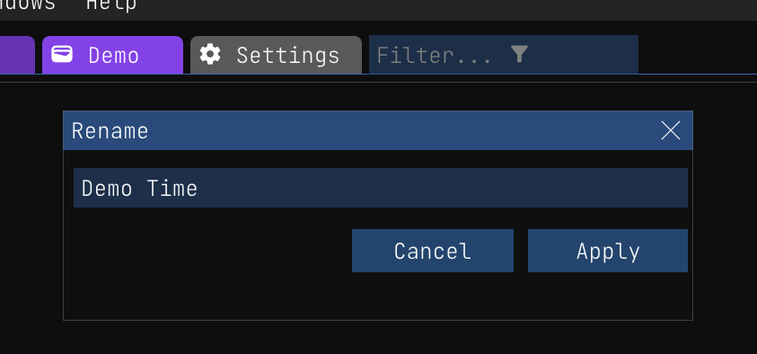
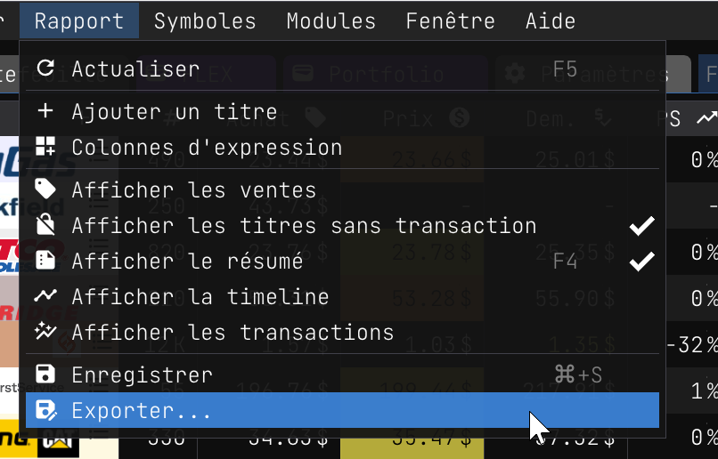

## Onglets

Un rapport est la pièce maîtresse de l'application. C'est là que vous suivez votre stock et vos ventes. C'est également là que vous pouvez voir vos profits et vos pertes. Vous pouvez avoir autant de rapports que vous le souhaitez, mais vous ne pouvez avoir qu'un seul rapport actif à la fois. 

### Passer d'un rapport à l'autre

Vous pouvez passer d'un rapport à l'autre en cliquant sur l'onglet correspondant.

## [Créer un nouveau rapport](./index.md#cr%C3%A9er-un-nouveau-rapport)

Vous pouvez créer un nouveau rapport en cliquant sur le bouton `Fichier/Créer/Rapport` ou en utilisant le raccourci `F2`. Vous serez invité à saisir un nom pour le rapport.

## Suppression d'un rapport

Si vous souhaitez supprimer un rapport, vous pouvez le faire en cliquant avec le bouton droit de la souris sur l'onglet du rapport et en sélectionnant `Supprimer`. Attention cependant, cette opération supprime le rapport et toutes les données qu'il contient. Il n'y a aucun moyen de récupérer un rapport supprimé. Cela dit, il est toujours judicieux d'exporter votre rapport avant de le supprimer afin de pouvoir récupérer manuellement les données si nécessaire. Vous pouvez [exporter](./report_export.md) un rapport en cliquant avec le bouton droit de la souris sur l'onglet du rapport et en sélectionnant `Exporter`.

### Sauvegardes

En fait, j'ai un peu menti, puisque l'application Wallet fait une sauvegarde chaque jour où vous l'ouvrez, vous pouvez récupérer un rapport supprimé en allant dans le dossier `backups` et en copiant le fichier de rapport à partir de là. Vous pouvez trouver le dossier `backup` sous `%LOCALAPPDATA%\Wiimag Inc\backups`. Cependant, notez que le fichier ne contient peut-être pas tout les dernières mise à jour.

## Renommer un rapport

Vous pouvez renommer un rapport en cliquant avec le bouton droit de la souris sur l'onglet du rapport et en sélectionnant `Renommer`.

## Fermer un rapport

Vous pouvez fermer un rapport en cliquant avec le bouton droit de la souris sur le bouton `X` de l'onglet du rapport. Cela fermera le rapport et le supprimera des onglets de rapport. Vous pouvez rouvrir un rapport fermé en allant dans `Fichier/Ouvrir/<NOM DU RAPPORT>` et en sélectionnant le rapport que vous voulez ouvrir.

# Menu

Le menu du rapport est l'endroit où vous pouvez trouver toutes les actions liées au rapport que vous êtes en train de visualiser. Vous pouvez basculer d'un ensemble d'options à l'autre en cliquant sur l'élément de menu correspondant.

Voici une liste de tous les éléments du menu et de leur fonction :

- **Actualiser** : Actualise le rapport. Par défaut, le rapport n'est pas actualisé automatiquement. En effet, le rafraîchissement du rapport peut prendre un certain temps et nous ne voulons pas ralentir l'application ou altérer l'expérience de l'utilisateur. Vous pouvez rafraîchir le rapport manuellement en cliquant sur le bouton de rafraîchissement ou en utilisant le raccourci `F5`. Lorsque vous rafraîchissez un rapport, vous pouvez remarquer un tas de couleurs qui clignotent à l'écran. C'est normal, puisque nous utilisons des couleurs pour indiquer qu'un titre a été modifié. Nous expliquerons ces couleurs plus loin.
- **[Ajouter un titre](./index.md#ajouter-une-nouvelle-action)** : Ajoute un nouveau titre au rapport. Vous pouvez également ajouter un nouveau titre en cliquant sur le bouton `+` dans le coin supérieur droit de la colonne `Titre`.
- **[Colonnes d'expression](./report_expression_columns.md)** : Cet élément de menu ouvre une boîte de dialogue dans laquelle vous pouvez ajouter, modifier et supprimer des colonnes d'expression. Les colonnes d'expression sont des colonnes qui sont calculées sur la base des valeurs d'autres colonnes. Vous pouvez en savoir plus sur les colonnes d'expression [ici](./report_expression_columns.md).
- **Afficher les ventes** : Cet élément de menu permet d'afficher les titres qui ont été vendus. Par défaut, nous n'affichons pas les titres vendus. En effet, nous voulons nous concentrer sur les titres qui sont encore en stock.
- **Afficher les titres sans transaction** : Cet élément de menu permet d'afficher les titres qui n'ont fait l'objet d'aucune transaction. Avoir des titres sans transactions n'est pas une mauvaise chose, mais il peut être déroutant de les voir dans le rapport. Par défaut, nous n'affichons pas les titres sans transactions. Vous pouvez utiliser les titres sans transactions dans un rapport de liste de surveillance pour les garder à l'œil.
- **Afficher le [résumé](./report_summary.md)** : Cet élément de menu permet d'afficher la section résumé. Par défaut, nous affichons la section résumé. Vous pouvez en savoir plus sur la [section résumé ici](./report_summary.md).
- **Afficher la [timeline](./report_timeline.md)** : Cet élément de menu ouvre une nouvelle fenêtre dans laquelle vous pouvez voir la chronologie du rapport. Vous pouvez en savoir plus sur la chronologie [ici](./report_timeline.md).
- **Enregistrer** : Cet élément de menu permet d'enregistrer le rapport. Vous pouvez également sauvegarder le rapport en cliquant sur le bouton de sauvegarde ou en utilisant le raccourci `Ctrl+S`. Si vous fermez le rapport sans l'enregistrer, celui-ci sera sauvegardé à la fermeture de l'applicaiton. Lorsque vous fermez l'application, tous les rapports sont automatiquement sauvegardés. Lorsqu'un rapport doit être sauvegardé, l'onglet du rapport comporte un `*` à côté du nom du rapport.
- **[Exporter...](./report_export.md)** : Cet élément de menu ouvre une boîte de dialogue dans laquelle vous pouvez exporter le rapport. Vous pouvez en savoir plus sur l'exportation d'un rapport [ici](./report_export.md).

# Anatomie du rapport

Comme vous passerez la majeure partie de votre temps dans la vue du rapport, il est important de comprendre son anatomie. Le rapport est divisé en 4 sections : les colonnes **(b)**, les lignes de titre **(d)**, le résumé des colonnes **(o)** et le panneau de résumé du rapport à droite **(j)**.

Avant d'entrer dans le détail de chaque section, énumérons les différentes parties du rapport :

- **(a)** : Les onglets de rapport. Vous pouvez passer d'un rapport à l'autre en cliquant sur l'onglet correspondant.
- **(b)** : La colonne `Titre` du rapport. Cette colonne est figée, ce qui signifie qu'elle sera toujours visible, même si vous faites défiler l'écran horizontalement. Vous pouvez cliquer sur le bouton `+` pour ouvrir la boîte de dialogue [Ajouter un titre](./index.md#ajouter-une-nouvelle-action).
- **(c)** : Les [colonnes](./report_columns.md). Vous pouvez ajouter, supprimer et réorganiser les colonnes en cliquant avec le bouton droit de la souris sur l'en-tête de la colonne.
- **(d)** : Symbole du titre et [logo](./update_icon.md). Vous pouvez double-cliquer sur le symbole pour ouvrir le [Modèle](./pattern.md) ou vous pouvez faire un clic droit sur le symbole pour ouvrir le menu contextuel du titre. Lorsqu'un titre vient de diminuer ou d'augmenter en valeur, nous ajoutons une icône de tendance à côté du nom du symbole. Enfin, vous pouvez cliquer sur le *hamburger* pour ouvrir le les [détails de transaction](./report_transactions.md).
- **(e)** : Chaque cellule affiche une valeur pour une colonne donnée. Les types de formats de cellules les plus basiques sont `Texte`, `Nombre` et `Date`. Vous pouvez en savoir plus sur les [formats de cellules ici](./report_columns.md#formats). Quant aux nombres, ils peuvent être présentés sous forme de `Monnaie`, `Pourcentage` ou `Arrondi`. Vous pouvez en savoir plus sur les [formats des nombres ici](./report_columns.md#numbers).
- **(f)** : Les cellules peuvent avoir des couleurs d'arrière-plan ou de premier plan. Pour en savoir plus sur les [couleurs des cellules, cliquez ici] (./report_columns.md#colors).
- **(g,h,i)** : Lignes de titre. Chaque ligne représente un titre. Chaque valeur affichée sur cette ligne correspond aux valeurs de ce titre.
- **(j)** : Le [résumé du rapport](./report_summary.md). Vous pouvez en savoir plus sur le [sommaire ici](./report_summary.md), mais il s'agit essentiellement d'un panneau qui affiche des statistiques sur le rapport et ses performances.
- **(k)** : [Paramètres du portefeuille](./wallet.md#settings) et [mesures du jour](./report_summary.md#current).
- **(l)** : Résultats de la vente. C'est ici que vous pouvez voir les résultats d'une transaction de vente. Vous pouvez en savoir plus sur les [transactions de vente ici](./report_summary.md#sells).
- **(m)** : [Menu du rapport actif](#menu). C'est ici que vous trouverez toutes les actions liées au rapport que vous êtes en train de consulter.
- **(n)** : [Statistiques du résumé du rapport](./report_summary.md#statistics). C'est ici que vous pouvez voir les statistiques du rapport. Pour en savoir plus sur les [statistiques du rapport, cliquez ici](./report_summary.md#statistics).
- **(o)** : [Résumé des colonnes](./report_summary.md#columns). C'est ici que vous pouvez voir le résumé d'une colonne.
- **(p)** : Zone vide. Vous pouvez faire un clic droit sur cette zone pour ouvrir un menu avec une série d'actions. Vous pouvez en savoir plus sur [ce menu ici](./report_columns.md#empty-zone).
- **(q)** : Filtrage des titres. Vous pouvez filtrer les titres en tapant dans la boîte de filtre. Vous pouvez en savoir plus sur [le filtrage des titres ici](#filtrage).
- **(r)**: La métrique qui compte! C'est ici que vous pouvez voir le profit et la perte du rapport. Si elle est verte, cela signifie que vous gagnez de l'argent. Si elle est jaune, faites attention, vous perdez probablement de l'argent. Vous pouvez en savoir plus sur [le profit et la perte ici](./report_summary.md#profit-and-loss).