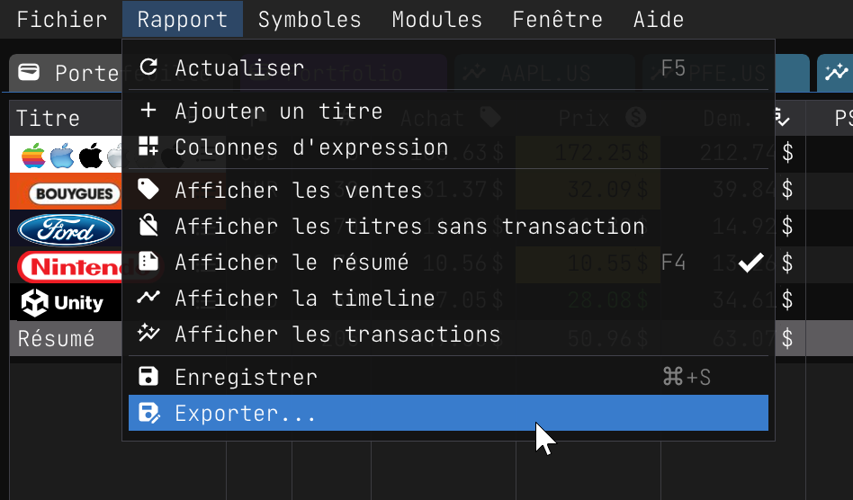
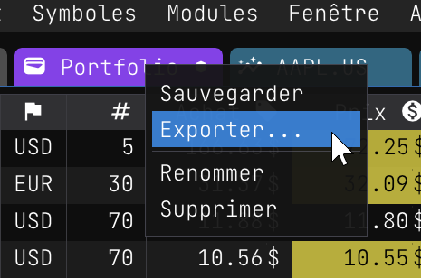

Exportation de rapports
=======================

Il peut être utile d'exporter un rapport vers un fichier, par exemple pour [l'importer](./report_import.md) dans un autre compte ou session. Les instructions suivantes vous montrent comment exporter un rapport au format `JSON`.

## Exportation de rapports

1. Cliquez sur le menu principal `Rapport`.
2. Cliquez sur l'élément de menu `Export...`.
3. Choisissez le nom et l'emplacement du fichier pour votre rapport.
4. Cliquez sur le bouton "Enregistrer" pour exporter le rapport.

|  |  |
|:---:|:---:|
|  | |

Lorsque la boîte de dialogue d'enregistrement du fichier s'affiche, vous pouvez saisir le nom du fichier que vous souhaitez utiliser pour exporter le rapport. Vous pouvez ensuite cliquer sur le bouton `Enregistrer` pour exporter le rapport.


Une fois le rapport exporté, vous trouverez le fichier dans le dossier que vous avez sélectionné.

Il est important de noter que le rapport exporté contient toutes les transactions. Il ne contient pas les paramètres du compte, il est donc *sécuritaire* d'importer le rapport dans un autre compte.

Voilà! L'essentiel est fait. Vous pouvez maintenant [importer le rapport](./report_import.md) dans un autre compte ou session.

## Contenu du rapport exporté

Le fichier exporté contient les informations suivantes :

- **id** : L'ID du rapport.
- **name** : Le nom du rapport.
- **wallet** : Les paramètres du portefeuille. Toutes les données historiques que vous suivez dans le portefeuille sont exportées. Ces données sont généralement affichées dans l'onglet "Portefeuille".
- **column** : Colonnes d'expression personnalisées. Si vous avez des colonnes d'expression personnalisées, elles sont exportées.
- **titles** : Les titres du rapport. Chaque titre contient les transactions pour chaque symbole boursier.

Le fichier exporté contient également les transactions pour chaque symbole boursier. Par exemple, la transaction suivante est exportée pour le symbole boursier `AAPL.US` :

```json
"AAPL.US": {
  "orders": [
    {
      "date": "2023-04-27",
      "buy": true,
      "sell": false,
      "price": 166.63,
      "qty": 5.00,
      "split": 1.00,
      "xcg": 1.36
    }
  ]
}
```

- **date** : La date de la transaction.
- **buy** : L'état d'achat de la transaction.
- **sell** : L'état de vente de la transaction.
- **price** : Le prix de la transaction.
- **qty** : La quantité de la transaction.
- **split** : La répartition de la transaction, le cas échéant (la valeur par défaut est 1,00).
- **xcg** : Le taux de change de la transaction si l'action est dans une devise différente de celle du portefeuille (la valeur par défaut est 1,00).

### <a href="/reports/Portfolio.report" download>Portfolio.report</a>

```json
id = "aed6acf1-e512-11ed-90b4-a04a5ed6cd32"
name = "Portfolio"
wallet = {
	funds = [
		{ currency = "CAD" amount = 10000.00 }
	]
	track_history = true
	currency = "CAD"
	show_extra_charts = false
	main_target = 0.250
	history = [
		{ date = "2023-05-09" funds = 10000.00 broker = 0.0000 investments = 5774.11 value = 5784.85 gain = 0.0000 assets = 0.0000 }
	]
}
columns = []
opened = true
show_no_transaction_title = false
show_sold_title = false
show_summary = true
order = 1.00
titles = {
	"AAPL.US" = {
		orders = [
			{ price = 166.63 qty = 5.00 buy = true date = "2023-04-27" split = 1.00 xcg = 1.36 }
		]
	}
	"U.US" = {
		orders = [
			{ date = "2023-04-28" buy = true qty = 30.00 price = 27.05 split = 1.00 xcg = 1.36 }
		]
	}
	"EN.PA" = {
		orders = [
			{ date = "2023-04-28" buy = true qty = 30.00 price = 33.20 split = 1.00 xcg = 1.50 }
		]
	}
	"NTDOY.US" = {
		orders = [
			{ date = "2023-05-01" buy = true qty = 70.00 price = 10.56 split = 1.00 xcg = 1.36 }
		]
	}
	"F.US" = {
		orders = [
			{ date = "2023-05-01" buy = true qty = 70.00 price = 11.88 split = 1.00 xcg = 1.36 }
		]
	}
}
```
