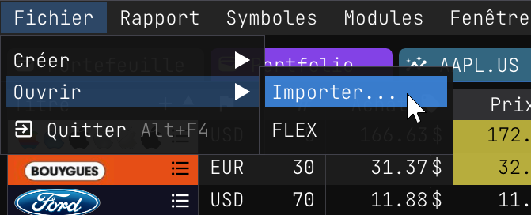
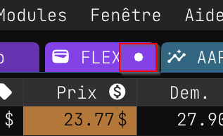
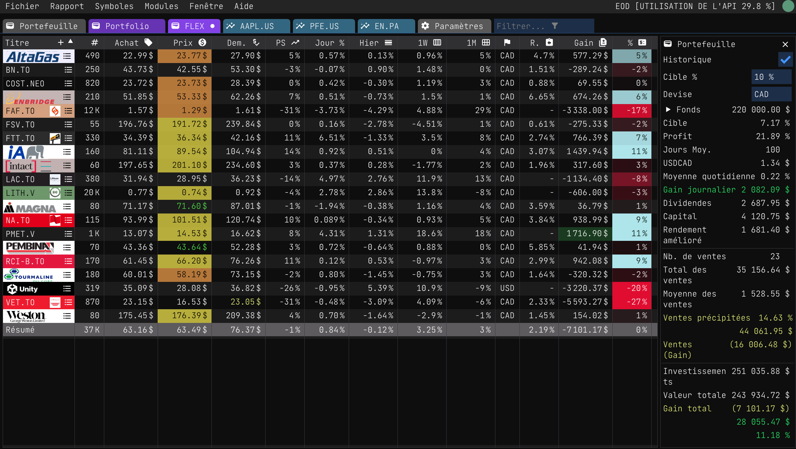
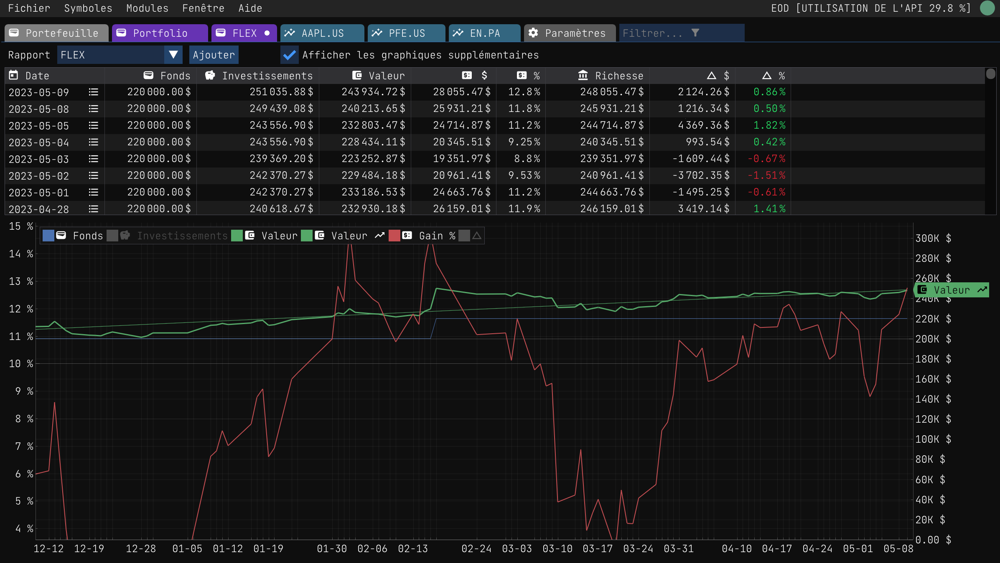

Importation de rapports
=======================

Si vous avez [précédemment exporté un rapport](./report_export.md), vous pouvez le réimporter dans l'application. Cette fonction est utile si vous souhaitez partager un rapport avec quelqu'un d'autre ou si vous souhaitez importer un rapport à partir d'un autre appareil.

## Importation d'un rapport

L'importation d'un rapport est simple. Suivez les étapes suivantes :

| | |
|:---|:---:|
| 1. Cliquez sur l'élément de menu `Fichier/Ouvrir/Importer...` |  | 
| 2. Sélectionnez le fichier que vous souhaitez importer dans la boîte de dialogue d'ouverture de fichier. | |
| 3. Cliquez sur le bouton `Ouvrir` pour importer le rapport. |  |

| | |
|:---|:---:|
| Lorsque le rapport est importé, il devrait s'afficher immédiatement dans l'application. Une fois importé, vous pouvez remarquer que le rapport est dans un état *dirty*, ce qui signifie que vous pouvez maintenant le sauvegarder. |  |

Vous pouvez sauvegarder le rapport en utilisant l'élément de menu `Report/Save` ou en appuyant sur le raccourci clavier `Ctrl+S`.

Voici un aperçu du rapport importé :

## Expressions personnalisées

Le rapport importé importe également les colonnes d'expressions personnalisées. Le partage de rapports est un excellent moyen de partager des expressions personnalisées. Les expressions personnalisées sont expliquées dans la section [Expressions personnalisées](./custom_expressions.md).

## Historique de suivi

Lorsque vous importez un rapport, l'historique de suivi du rapport original est également importé. Pour afficher l'historique de suivi du rapport importé, allez dans l'onglet Portefeuille.

## Emplacement du rapport

Le rapport est importé dans le dossier de votre session utilisateur. Par défaut, vous pouvez trouver le dossier de la session utilisateur à l'emplacement suivant :

- MacOS: `$HOME/Wiimag Inc/Wallet/reports`
- Windows: `%LOCALAPPDATA%\Wiimag Inc\Wallet\reports`

Toute modification ultérieure n'affectera pas le fichier importé. 

## Exemples de rapports

Pour votre commodité, voici le contenu des fichiers `Portfolio.report` et `Flex.report` qui ont été importés :

- <a href="/reports/FLEX.report" download>Flex.report</a>
- <a href="/reports/Portfolio.report" download>Portfolio.report</a>

Amusez-vous à importer et à partager des rapports !
