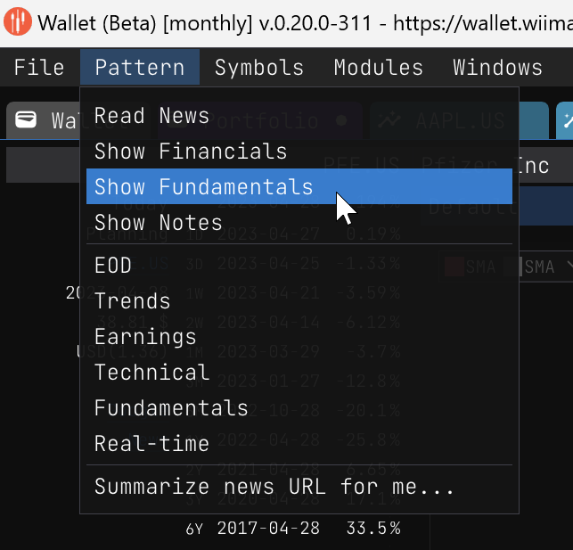
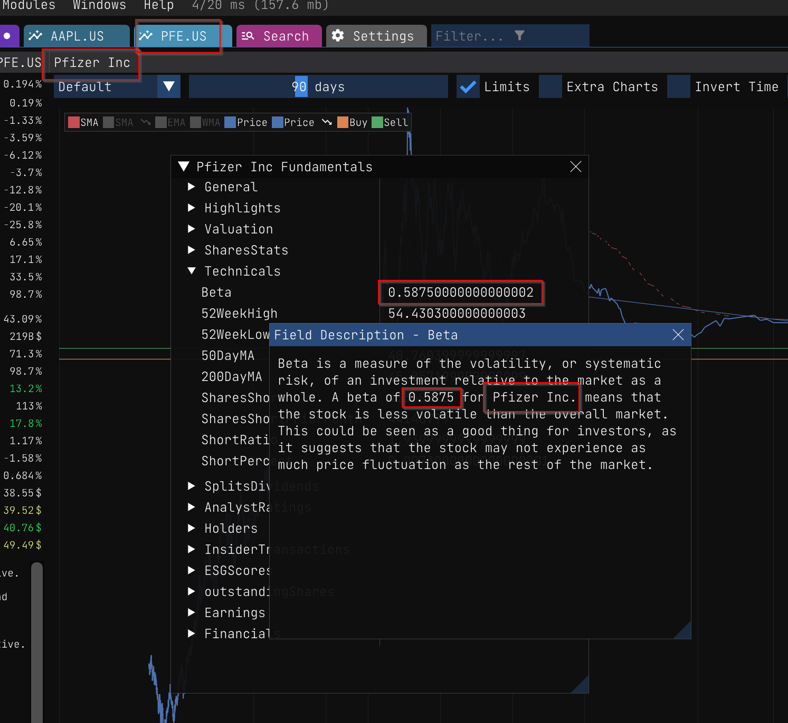
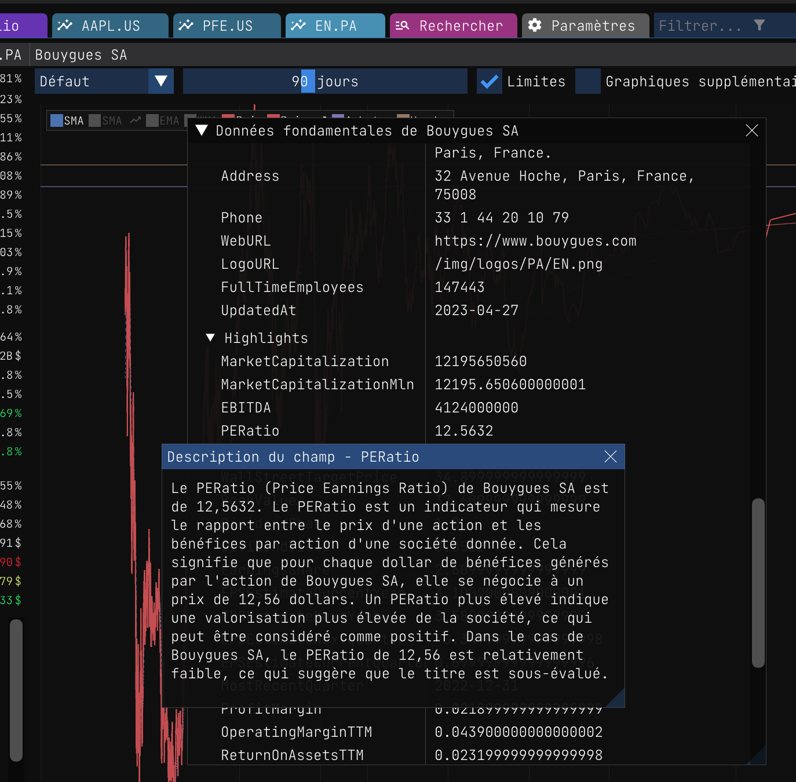

Fondamentaux des modèles boursiers
==================================

### <a href="https://eodhistoricaldata.com/financial-apis/stock-etfs-fundamental-data-feeds/?ref=PF9TZC2T" target="_blank">API</a>

En tant que nouvel investisseur, il est important de comprendre les performances d'une entreprise avant d'investir. L'application Wallet peut vous y aider en vous fournissant une représentation visuelle des fondamentaux d'une entreprise par le biais d'une série de graphiques. Cependant, avant de se plonger dans les graphiques, il est important de comprendre ce qu'ils signifient.

Pour comprendre le fonctionnement des graphiques, il faut comprendre les valeurs fondamentales d'une action. L'application Wallet permet à l'utilisateur de visualiser les fondamentaux à l'aide d'une simple vue arborescente.

Pour commencer, vous devez ouvrir la vue du modèle pour une action particulière. Vous pouvez accéder à cette vue à partir de la vue du rapport ou de la recherche.

Une fois que vous avez ouvert la vue du modèle, vous pouvez cliquer sur l'élément de menu intitulé `Pattern/Afficher les valeurs fondamentales` pour ouvrir la vue des valeurs fondamentales. Ici, vous verrez une arborescence sur la gauche et les valeurs fondamentales brutes sur la droite.

Ce n'est pas grave si vous ne comprenez pas tous les principes fondamentaux au début. Vous pouvez apprendre au fur et à mesure ! L'application Wallet offre un moyen simple d'obtenir davantage d'informations sur un domaine particulier. 

Il suffit de cliquer sur l'étiquette du champ qui vous intéresse pour faire apparaître une fenêtre contenant plus d'informations sur ce champ dans le contexte de l'action en cours.

L'application Wallet ouvrira une petite fenêtre et affichera les informations sur le champ sélectionné dans le contexte de l'action en cours.

C'est pas cool ça ? Lorsque vous avez fini de lire les informations sur le domaine, il vous suffit de cliquer sur le bouton "X" pour fermer la fenêtre. Mais puisque c'est si cool, montrons un autre exemple.

En comprenant les fondamentaux d'une entreprise, vous pouvez prendre des décisions d'investissement éclairées qui s'inscrivent dans votre stratégie d'investissement. Voyons comment l'application Wallet peut vous aider à mieux comprendre un domaine particulier.

Vous pouvez trouver des informations supplémentaires sur les [Données fondamentales expliquées ici](https://eodhistoricaldata.com/financial-apis/fundamental-data-explained/?ref=PF9TZC2T).
